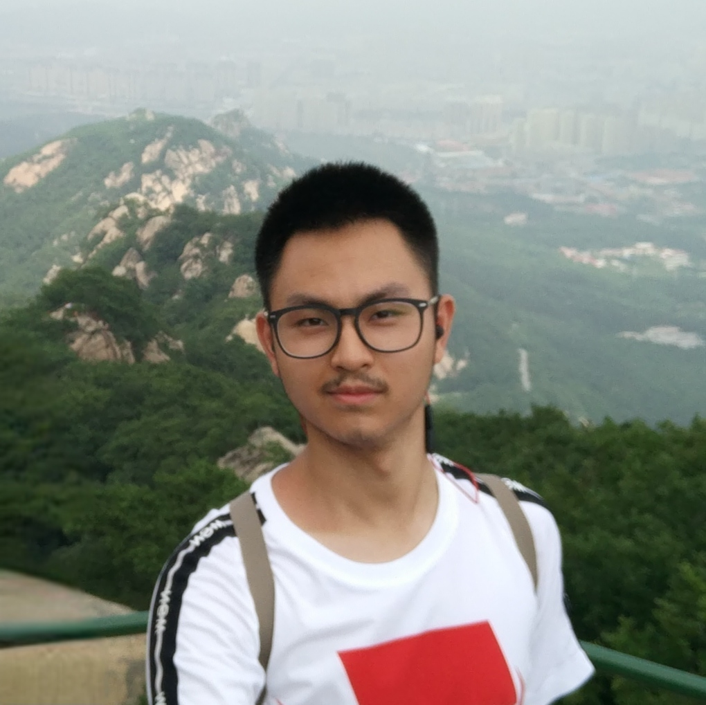
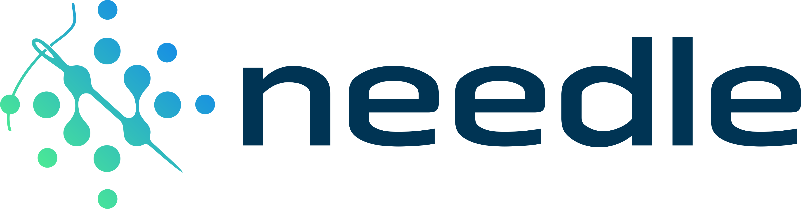
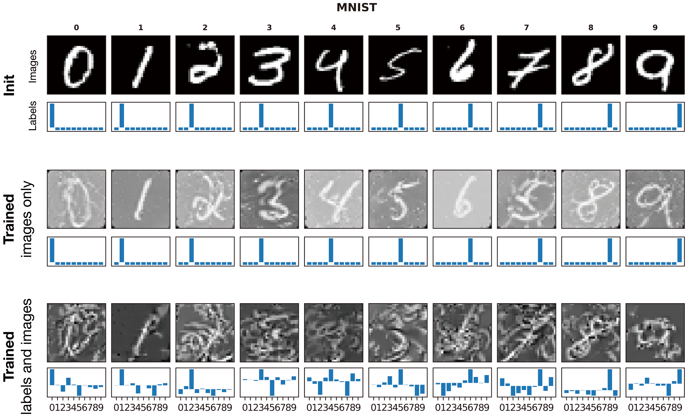

<!-- landing page -->
# Hello there

## About me

I am YU Yue (Will), an undergraduate at the [University of Hong Kong](https://www.hku.hk).

## Research

My research interest includes machine learning system, neural rendering, **in-memory computing**, and computer architecture.  

### NeRF

<YouTube id="gGaqqs5Q-yo" autoplay=true loop=true disableFullscreen=false />

[*Neural radiance field*](https://www.matthewtancik.com/nerf) (NeRF) **implicitly** represents a 3D scene with a multi-layer perceptron (MLP) $F: (\boldsymbol{x}, \boldsymbol{d}) \rightarrow (\boldsymbol{c}, \sigma)$ for some position $\boldsymbol{x} \in \mathbb{R}^3$, view direction $\boldsymbol{d} \in [0, \pi) \times [0, 2\pi)$, color $\boldsymbol{c}$, and "opacity" $\sigma$. Rendered results are spectacular.

I am currently working on rapid and accurate 3D reconstruction of real-world scenes with NeRF. See [my posts](./blog/ml/nerf/) ([link](./blog/ml/nerf/)) on NeRF.

### MLSys

*Needle* is a deep learning library with customized GPU and NumPy CPU backend. The project is still in progress; see [my repository](https://github.com/YconquestY/Needle) for details.

### NTK

Ever though of achieving $65$% test accuracy on CIFAR-10 with merely $10$ data points? *Neural tangent kernel* (NTK) is the way.[^way]

[^way]: "This is the way" is a line in the Star Wars series [the Mandalorian](https://www.disneyplus.com/en-gb/series/the-mandalorian/3jLIGMDYINqD), which describes the "Mando" style. It is cited here to emphasize only NTK may achieve such an unbelievable result as dataset distillation.
