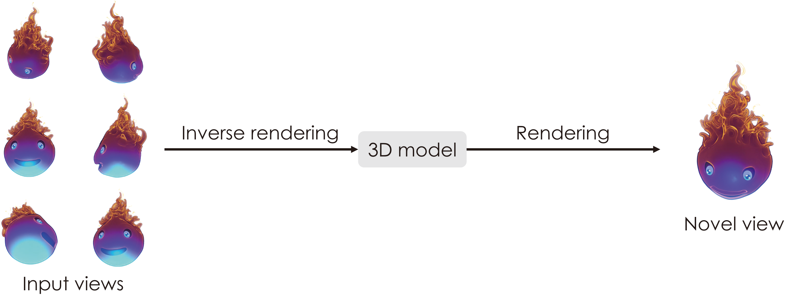
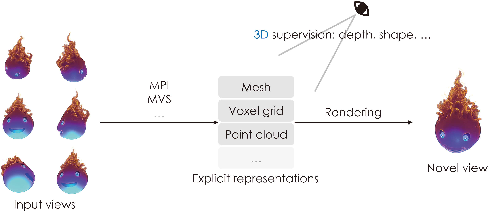
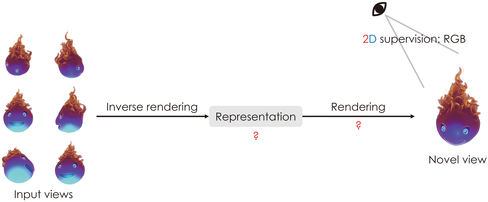
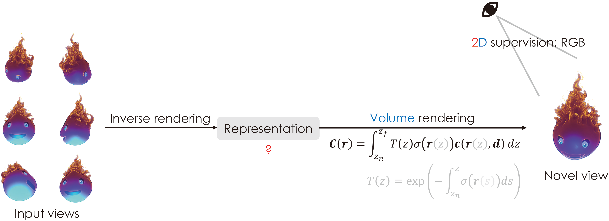
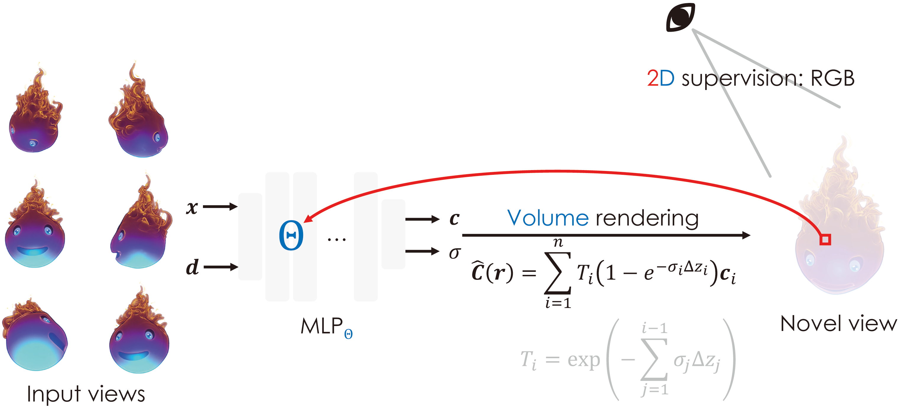
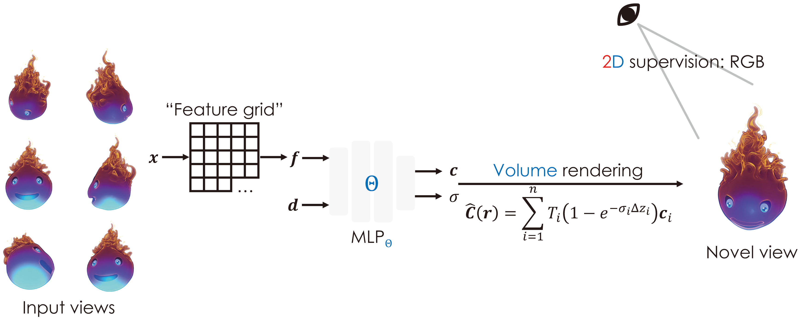
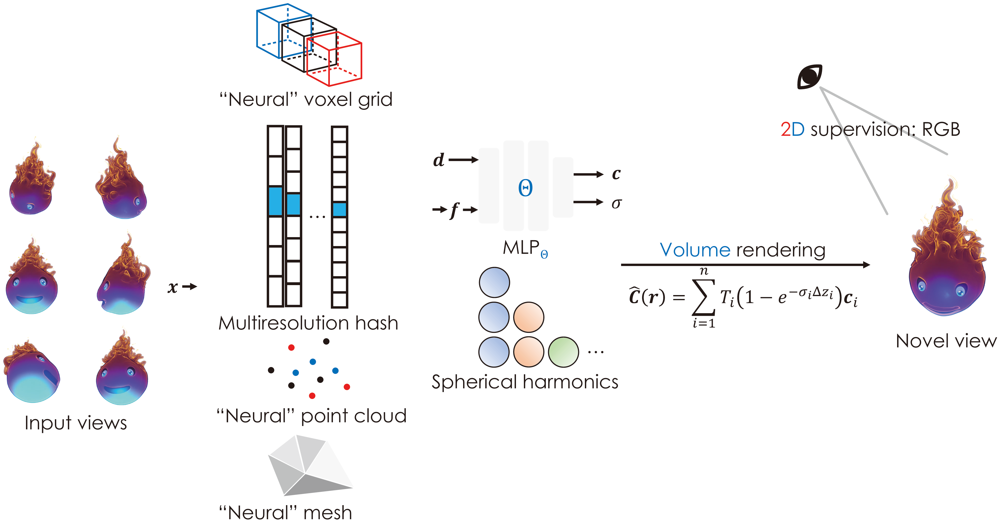

# A Surge in NeRF

## News

<!--My post on [volume rendering](./nerf_rendering.html) is out! [link](./nerf_rendering.html) 
My post on [NDC space](./nerf_ndc.html) is out! [link](./nerf_ndc.html) -->

## Overview

neural radiance field (NeRF)

extended to other fields such as generative modeling (GRAF, GIRAFFE, DreamField), relighting (?, NeRF-OSR), scene editing (CCNeRF), etc.

focus on nvs/reconstruction

## Background

### What do we want?

*Novel view synthesis* (NVS) refers to the problem of capturing a scene from a novel angle given a few input images. With downstream applications to modeling, animation, and mixed reality, NVS is fundamental to the computer vision (CV) and computer graphics (CG) fields.

The problem is typically attacked in two stages: inverse rendering — constructing a 3D representation from input images — and rendering — mapping high-dimensional to pixel colors of a raster image.

**CV for inverse rendering** A 3D model can be explicitly represented by mesh, point cloud, voxel grid, or **m**ulti-**p**lane **i**mages (MPI). This renders learning-based solutions to other pertinent problems, such as **s**tructure **f**rom **m**otion (SfM) and **m**ulti-**v**iew **s**tereo (MVS), qualified for ?. Nonetheless, those approaches are often dependent on direct supervion, where 3D ground truths are time-consuming to obtain. Explicit representations are also memory-demanding. Hence, learning-based CV schemes hardly scale to real-world scenes.

**Is there a way to learn from 2D supervision? Is there a way to reduce memory footprint of 3D representations?** This is where NeRF steps in. Before proceeding to its thrival, there is a (significant) obstacle to overcome — the rendering process **must** be differentiable. Otherwise, gradients cannot propagate back to the geometric representation, and the network never congerges.

### Differentiable rendering

Classical graphics pipelines leverage matrix operations on triangular (or polygonal) meshes for a raster image. This process is **not** differentiable in that gradient w.r.t. geometry is either hard to compute or unhelpful. 3D representations for differentiable rendering tend to be **implicit**. [DVR](https://avg.is.mpg.de/publications/niemeyer2020cvpr), with a misleading[^mislead] title, differentiably renders a pixel given implicit surfaces. An alternative is [volume rendering](./nerf_rendering.html), where a ray $\boldsymbol{r} = \boldsymbol{o} + z\boldsymbol{d}$ "casts" to a volumetric representation, and colors are "cummulated" by

$$
\mathbf{C}(\boldsymbol{r})
=
\gray{\mathbf{C}(z; \boldsymbol{o}, \boldsymbol{d})
=}
\int_{z_n}^{z_f} T\gray{(z)} \sigma \left( \boldsymbol{r}\gray{(z)} \right) \boldsymbol{c} \left(\boldsymbol{r}\gray{(z)}, \boldsymbol{d} \right) \ dz, \ T(z) =  \exp \left(-\int_{z_n}^z \sigma \left(\boldsymbol{r} \gray{(s)} \right) \ ds \right)
$$

given "volume density" $\sigma$ and color $\boldsymbol{c}$.

### Ray tracing? Ray casting? Ray marching!

[Volume rendering](./nerf_rendering.html) is an image-ordered approach. For every pixel, a ray ejects from the camera, passes through the pixel center, and "casts" to the volumetric representation. Unlink *ray tracing*, it does **not** reflect off surfaces. Rather, it marches through the entire volume. This is reminiscent of *ray casting*, widely applicable in medical imaging. On the constrary, it does **not** intend to reveal the internal structure of "volume data". What we want is the color of that pixel. Such a novel approach is referred to ***ray marching***.

## Analysis

The above integral demands the **continuity** of $\sigma$ and $\boldsymbol{c}$, making the volumetric representation essentially a [*scalar field*](https://en.wikipedia.org/wiki/Field_(physics)).

**MLP as radiance field** 
### Entirely implicit? A step back…

### "Men are still good."[^bvs]

mip-NeRF, mip-NeRF 360, ref-NeRF

## Summary

[^mislead]: ?

[^bvs]: "Men are still good" is an ending line of the film [Batman v Superman: Dawn of Justice](https://www.imdb.com/title/tt2975590/) conveying Bruce Wayne's faith in mankind. It is cited here to imply that pure MLP representations of radiance field are not (at all) inferior to "hybrid" rpresentations, in terms of quality, of course.

## References

[CS184/284a](https://cs184.eecs.berkeley.edu) by [UC Berkeley](https://eecs.berkeley.edu) 
[CS348n](http://graphics.stanford.edu/courses/cs348n-22-winter/) by [Stanford University](https://cs.stanford.edu/) 
[DIVeR: Real-time and Accurate Neural Radiance Fields with Deterministic Integration for Volume Rendering](https://arxiv.org/abs/2111.10427) 
[Instant Neural Graphics Primitives with a Multiresolution Hash Encoding](https://nvlabs.github.io/instant-ngp/assets/mueller2022instant.pdf) 
[Mip-NeRF: A Multiscale Representation for Anti-Aliasing Neural Radiance Fields](https://arxiv.org/abs/2103.13415) 
[NeRF: Representing Scenes as Neural Radiance Fields for View Synthesis](https://arxiv.org/abs/2003.08934) 
[Neural Sparse Voxel Fields](https://arxiv.org/abs/2007.11571) 
[PlenOctrees for Real-time Neural Radiance Fields](https://arxiv.org/abs/2103.14024) 
[Plenoxels: Radiance Fields without Neural Networks](https://arxiv.org/abs/2112.05131) 
[Point-NeRF: Point-based Neural Radiance Fields](https://arxiv.org/abs/2201.08845) 
[Ref-Nerf: Structured View-Dependent Appearance for Neural Radiance Fields](https://arxiv.org/abs/2112.03907)

## Errata

| Time        | Modification    |
| ---         | ---             |
| Sep 18 2022 | Pre-release     |
| Oct 16 2022 | Initial release |
