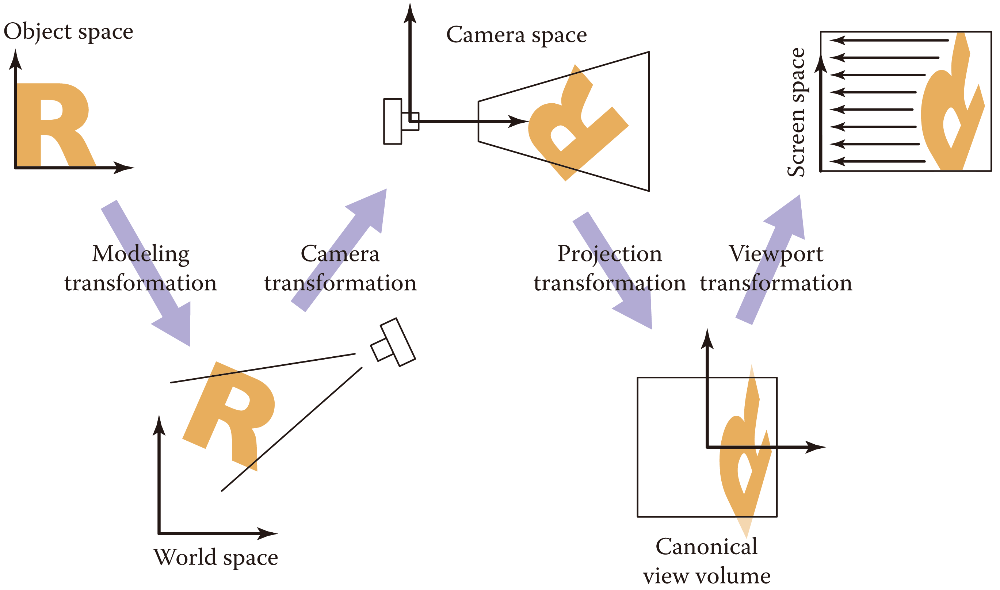
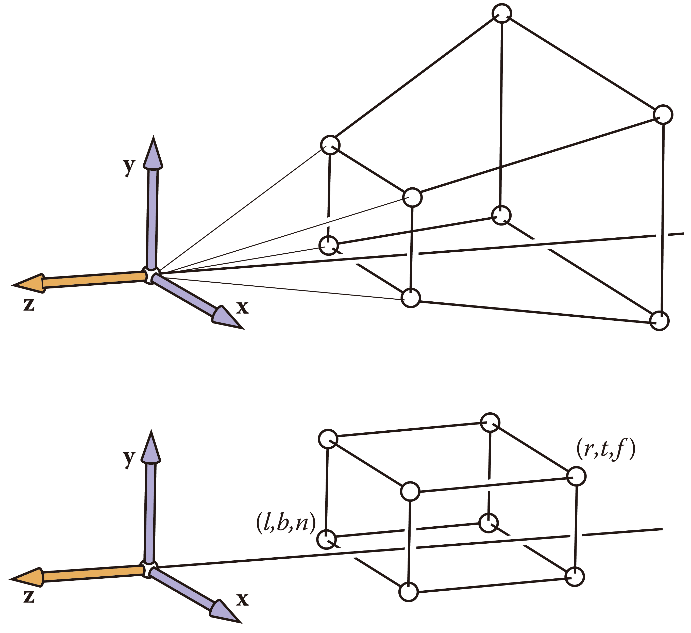
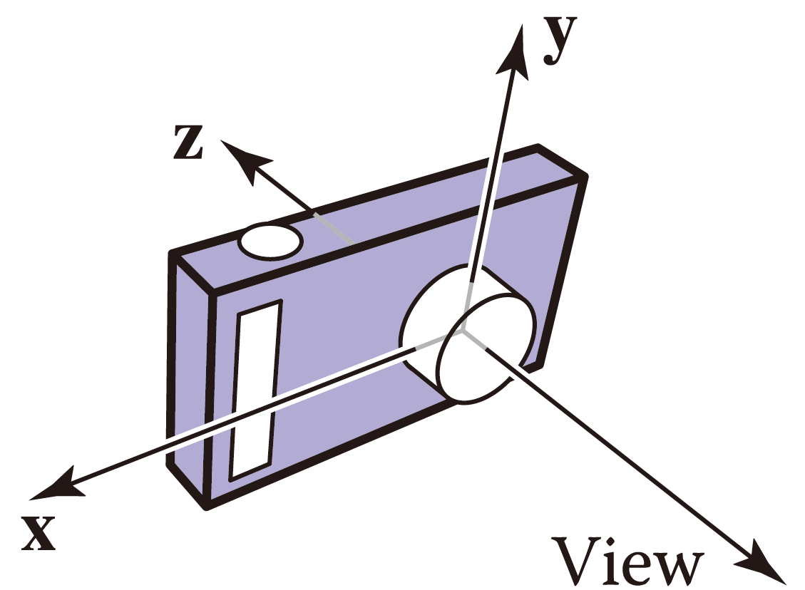
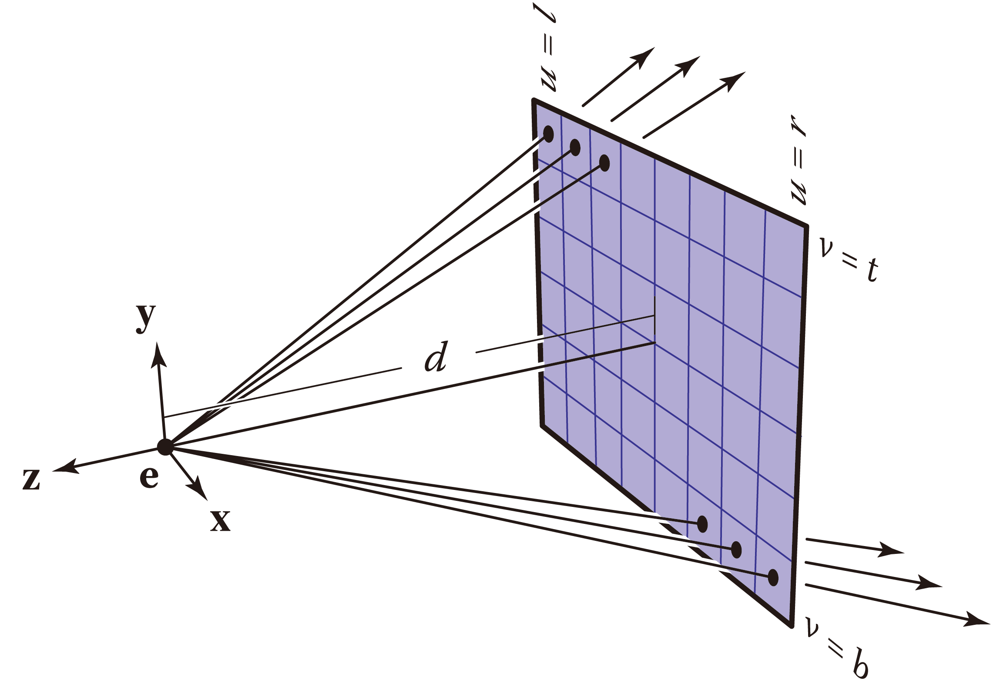
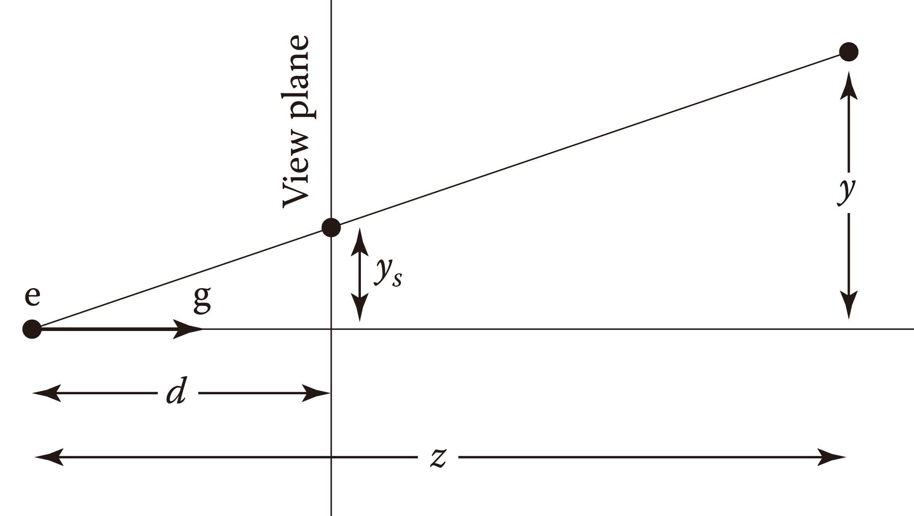
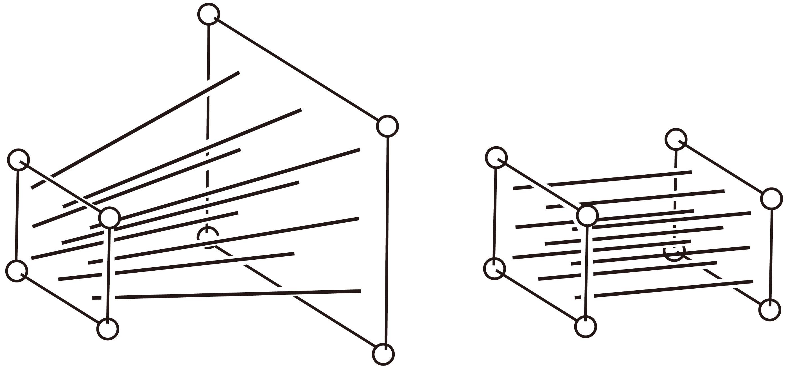
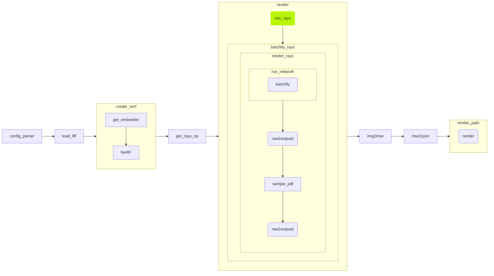

# NeRF: How NDC Works

## Overview

[NeRF](https://www.matthewtancik.com/nerf) **implicitly** represents a 3D scene with a multi-layer perceptron (MLP) $F: (\boldsymbol{x}, \boldsymbol{d}) \rightarrow (\boldsymbol{c}, \sigma)$ for some position $\boldsymbol{x}$, view direction $\boldsymbol{d}$, color $\boldsymbol{c}$, and "opacity" $\sigma$. Renders results are spectacular.

There have been a number of articles introducing NeRF since its publication in 2020, but most of them neglect a subtle operation in implementation — scenes from the [LLFF dataset](https://drive.google.com/drive/folders/14boI-o5hGO9srnWaaogTU5_ji7wkX2S7) are projected to NDC space before modeled by the MLP.

This post elaborates on NDC space and corresponding projection operations. Both mathematical derivation and implementation will be analyzed.

## Preliminaries

- Having read the [NeRF paper](https://arxiv.org/abs/2003.08934)
- Linear algebra
- Familiarity with [NumPy](https://numpy.org/)

## Background

In a graphics pipeline, viewing transformation is responsible for mapping each 3D location $\boldsymbol{x}$ in the canonical coordinate ("world" coordinate) system to image space, measured in pixels. Such a procedure typically includes three components:

- camera transformation
- projection transformation
- viewport transformation

which is illustrated below.

"A camera transformation is a rigid body transformation
that places the camera at the origin in a convenient orientation. It depends only on the position and orientation, or pose, of the camera." <!-- cited from chapter 7, FoCG -->

A projection transformation maps points in camera space to a $[-1, 1]^3$ cube whose center $\boldsymbol{e} = \boldsymbol{0}$ lies the camera. Such a cube is called a *canonical view volume* or the *normalized device coordinates* (NDC).

A viewport transformation "flattens" the $[-1, 1]^3$ NDC and maps the $2 \times 2$ square to a *raster image*. The image measures $H$ in height and $W$ in width; the unit is pixel.

NeRF does **not** adopt camera transformation because camera position $\boldsymbol{x}$ (w.r.t. world coordinates) is an input to the multi-layer perceptron (MLP). **Neither** does it use viewport transformation since information is queried implicitly from the MLP rather than constructed from a gauged object. NeRF performs projection transformation directly on world coordinates for the LLFF dataset. Let's figure out the mechanism of projection transformation.

<!-- This is actually a `note` container. -->
::: info Frame of reference
Although NeRF performs NDC conversion in world space, this post derives it w.r.t. camera frame. Transition to world coordinates is implemented by a matrix multiplication with `c2w`, which is comprised of a rotation matrix $\mathbf{R} \in \mathbb{R}^{3 \times 3}$ and a translation vector $\boldsymbol{t} \in \mathbb{R}^3$.
$$
\verb|c2w| = \begin{bmatrix} \mathbf{R} & \boldsymbol{t} \\ \boldsymbol{0} & 1 \end{bmatrix}
$$
:::

Projection tranfromation is decomposed into perspection projection followed by orthographic projection.

Perspection projection converts a camera frustum into a cuboid bounded by

| Planes | Coordinates |
| ---    | ---         |
| left   | $x = l  \gray{\lt 0}$ |
| right  | $x = r  \gray{\gt 0}$ |
| bottom | $y = b  \gray{\lt 0}$ |
| top    | $y = t  \gray{\gt 0}$ |
| far    | $z = f' \gray{\lt 0}$ |
| near   | $z = n' \gray{\lt 0}$ |

<!-- This is actually a `note` container. -->
::: info Camera coordinates
In a camera coordinate system, $z$-axis points backwards by the right hand rule. Consequently, $\gray{0 \gt} n' \gt f'$.

<table>
    <tr>
        <td>
            
        </td>
        <td>
            
        </td>
    </tr>
</table>
:::

Focus on 1D perspective transformation first. Suppose the gaze direction $\boldsymbol{g}$ coincides with the $-z$-axis, then the object appears on the image plane
$$
\begin{align*}
\gray{\frac{y_s}{d}} &\gray{= \frac{y}{z}} \\
y_s &= \frac{d}{z} y
\end{align*}
$$ 
which means
$$
\begin{bmatrix}
y_s \\ 1
\end{bmatrix}
\sim
\begin{bmatrix}
d & 0 & 0 \\
0 & 1 & 0
\end{bmatrix}
\begin{bmatrix}
y \\ z \\ 1
\end{bmatrix}
=
\begin{bmatrix}
dy \\ z
\end{bmatrix}
$$

<!-- This is actually an `info` container. -->
::: note Homogeneous coordinate
Coordinates are "homogeneous" in that they can be translated, rotated, and scaled via a **single** matrix multiplication. By appending a fourth entry to a 3D coordinate $\boldsymbol{x}$ and multiplying it with a transformation $\mathbf{M}$, homograhpy dominates render operations and computer vision. 
:::

Generalizing perspective projection to 3D, the *perspective matrix* is
$$
\mathbf{P} =
\begin{bmatrix}
n' & 0 & 0 & 0 \\
0 & n' & 0 & 0 \\
0 & 0 & n'+f' & -n'f' \\
0 & 0 & 1 & 0
\end{bmatrix}
$$

"Perspective projection leaves points on the $z = -n'$ plane unchanged and transforms the large and (potentially very) far rectangle at the back of the perspective volume to the $z = -f'$ rectangle at the back of the orthographic volume." Essentially, such projection "maps any line through the camera (or eye) to a line parallel to the $z$-axis without moving the point on the line at $z = -n'$."

<!-- This is actually a `note` container. -->
::: info Perspective projection matrice are scalable.
Any scaled perspective projection matrix $c\mathbf{P}$ with $c \in \mathbb{R} \verb|\| \{0\}$ is equivalent in that the coordinates of an projected point $\boldsymbol{x}_{\text{proj}}$ is the ratio of entries to $c\mathbf{P}\boldsymbol{x}$.
:::

Orthographic projection scales the $[l, r] \times [b, t] \times [f', n']$ volume to a $2 \times 2 \times 2$ cude, and further shifts it to a $[-1, 1]^3$ one. Now, the camera $\boldsymbol{e}$ lies at its center. Such an operation is characterized by
$$
\begin{align*}
\mathbf{M}_{\text{orth}}
&=
\underbrace{\begin{bmatrix}
\mathbf{I}_{3 \times 3} & \begin{matrix} -1 \\ -1 \\ 1 \end{matrix} \\
\boldsymbol{0}_{1 \times 3} & 1
\end{bmatrix}}_\text{translation: center to origin}

\underbrace{\begin{bmatrix}
\begin{matrix}
\frac{2}{r-l} & 0 & 0 \\
0 & \frac{2}{t-b} & 0 \\
0 & 0 & \frac{2}{n'-f'} \\
\end{matrix} & \boldsymbol{0}_{3 \times 1} \\
\boldsymbol{0}_{1 \times 3} & 1
\end{bmatrix}}_\text{scaling: volume to cube}

\underbrace{\begin{bmatrix}
\mathbf{I}_{3 \times 3} & \begin{matrix} -l \\ -b \\ -n' \end{matrix} \\
\boldsymbol{0}_{1 \times 3} & 1
\end{bmatrix}}_\text{translation: corner to origin} \\
&=
\begin{bmatrix}
\frac{2}{r-l} & 0 & 0 & -\frac{r+l}{r-l} \\
0 & \frac{2}{t-b} & 0 & -\frac{t+b}{t-b} \\
0 & 0 & \frac{2}{n'-f'} & -\frac{n'+f'}{n'-f'} \\
0 & 0 & 0 & 1
\end{bmatrix}
\end{align*}
$$

::: tip Physical meaning of matrix multiplication
Check [3B1B](https://www.3blue1brown.com)'s videos ([linear transformation](https://www.youtube.com/watch?v=kYB8IZa5AuE), [matrix multiplication](https://www.youtube.com/watch?v=XkY2DOUCWMU), and [3D trnsformation](https://www.youtube.com/watch?v=rHLEWRxRGiM)) on linear algebra to comprehend what the above linear transformations (matrices) physically mean.
:::

Scale $\mathbf{P}$ by $-1$, and put the two parts together, the projection matrix is
$$
\begin{align*}
\mathbf{M}_{\text{per}}
&=
\mathbf{M}_{\text{orth}} \left(-\mathbf{P}\right) \\
&=
\begin{bmatrix}
\frac{2}{r-l} & 0 & 0 & -\frac{r+l}{r-l} \\
0 & \frac{2}{t-b} & 0 & -\frac{t+b}{t-b} \\
0 & 0 & \frac{2}{n'-f'} & -\frac{n'+f'}{n'-f'} \\
0 & 0 & 0 & 1
\end{bmatrix}

\begin{bmatrix}
-n' & 0 & 0 & 0 \\
0 & -n' & 0 & 0 \\
0 & 0 & -n'-f' & n'f' \\
0 & 0 & -1 & 0
\end{bmatrix} \\
&=
\begin{bmatrix}
-\frac{2n'}{r-l} & 0 & \frac{r+l}{r-l} & 0\\
0 & -\frac{2n'}{t-b} & \frac{t+b}{t-b} & 0 \\
0 & 0 & -\frac{n'+f'}{n'-f'} & \frac{2n'f'}{n'-f'} \\
0 & 0 & -1 & 0
\end{bmatrix}
\end{align*}
$$

Both $n'$ and $f'$ is less than $0$ since $z$-axis points backwards. Take their absolute values to make it intuitive. Let
$$
\begin{align*}
n &:= |n'| \gray{= -n'} \\
f &:= |f'| \gray{= -f'}
\end{align*}
$$
be depth values. Substitute $\gray{0 \lt} n \lt f$ (for $\gray{0 \gt} n' \gt f'$) into $\mathbf{M}_{\text{per}}$, then
$$
\mathbf{M}_{\text{per}}
=
\begin{bmatrix}
\frac{2n}{r-l} & 0 & \frac{r+l}{r-l} & 0\\
0 & \frac{2n}{t-b} & \frac{t+b}{t-b} & 0 \\
0 & 0 & \red{-}\frac{n+f}{n-f} & \red{-}\frac{2nf}{n-f} \\
0 & 0 & -1 & 0
\end{bmatrix}
$$

There remains one subtle difference between the official projection transformation matrix and our derived one — the third row, i.e., the sign of $z$ coordinates. The third entry of $\boldsymbol{x}_{\text{proj}}$ must be positive in graphics frameworks like OpenGL. The final matrix is
$$
\mathbf{M}_{\text{per}}
=
\begin{bmatrix}
\frac{2n}{r-l} & 0 & \frac{r+l}{r-l} & 0\\
0 & \frac{2n}{t-b} & \frac{t+b}{t-b} & 0 \\
0 & 0 & \blue{-}\frac{f+n}{\blue{f-n}} & \blue{-}\frac{2nf}{\blue{f-n}} \\
0 & 0 & -1 & 0
\end{bmatrix}
$$

In retrospect, reversing the sign of $z$ coordinates amounts to turning $z$-axis to its opposite direction. This affects both marched rays and the object. Nonetheless, an object in NeRF is modeled **implicitly** by an MLP. Simplly warping sampling rays, in this case ray origins $\boldsymbol{o}$ and directions $\boldsymbol{d}$, is enough.

The camera frustum is generally symmetric along $x$- and $y$-axes, then
$$
\begin{align*}
l &= -r \\
b &= -t
\end{align*}
$$

The projection matrix is therefore reduced to
$$
\mathbf{M}_{\text{per}}
=
\begin{bmatrix}
\frac{n}{r} & 0 & 0 & 0\\
0 & \frac{n}{t} & 0 & 0 \\
0 & 0 & -\frac{f+n}{f-n} & -\frac{2nf}{f-n} \\
0 & 0 & -1 & 0
\end{bmatrix}
$$

## Analysis

A point $\boldsymbol{x} = \begin{bmatrix} x & y & z & 1 \end{bmatrix}^{\mathsf{T}}$ from both an object and a ray $\boldsymbol{r} = \boldsymbol{o} + t\boldsymbol{d}$ in world space is projected to
$$
\begin{bmatrix} -\frac{n}{r} \frac{x}{z} \\ -\frac{n}{t} \frac{y}{z} \\ \frac{f+n}{f-n} + \frac{2nf}{f-n} \frac{1}{z} \\ \gray{1} \end{bmatrix}
= 
\boldsymbol{x}' \sim \mathbf{M}_{\text{per}} \boldsymbol{x}
=
\begin{bmatrix} \frac{n}{r} x \\ \frac{n}{t} y \\ -\frac{f+n}{f-n} z - \frac{2nf}{f-n} \\ -z \end{bmatrix}
$$
in NDC space.

<!-- This is actually a `note` container. -->
::: info Multiplexed parameter
The parameter $t$ is **overloaded**. It can be interpreted as the distance from the ray origin $\boldsymbol{o}$ along direction $\boldsymbol{d}$, or as **top** boundary of the image plane.
:::

Denote the projected ray as $\boldsymbol{r}' = \boldsymbol{o}' + t'\boldsymbol{d}'$. It is key to ensure rays $\boldsymbol{r}$ and $\boldsymbol{r}'$ trace the same "implicit" voxels of an object. Let
$$
\begin{align*}
a_x &:= -\frac{n}{r} \\
a_y &:= -\frac{n}{t} \\
a_z &:= \frac{f + n}{f - n} \\
b_z &:= \frac{2nf}{f - n}
\end{align*}
$$
then a point in NDC is denoted as $\begin{bmatrix} a_x \frac{x}{z} \\ a_y \frac{y}{z} \\ a_z + \frac{b_z}{z} \end{bmatrix}$. This applies to all points along the projected ray:
$$
\begin{bmatrix} a_x \frac{o_x + t d_x}{o_z + t d_z} \\ a_y \frac{o_y + t d_y}{o_z + t d_z} \\ a_z + \frac{b_z}{o_z + t d_z} \end{bmatrix}
=
\begin{bmatrix} o'_x + t' d'_x \\ o'_y + t' d'_y \\ o'_z + t' d'_z \end{bmatrix}
\forall t \in [0, \infty)
$$
with $\boldsymbol{o}'$, $t'$, and $\boldsymbol{d}'$ undetermined. There are infinitely many solutions to the above system of $3$ equations with $7$ <!-- Is it really 7? --> degrees of freedom. Focuses on ray origins first. Suppose world coordinates of $\boldsymbol{o}'$ are consistent with those of $\boldsymbol{o}$'s even after projection. Let $t = t' = 0$, then
$$
\boldsymbol{o}
=
\begin{bmatrix}
o_x \\ o_y \\ o_z
\end{bmatrix}
\xrightarrow{\text{perspective projection}}
\begin{bmatrix}
a_x \frac{o_x}{o_z} \\
a_y \frac{o_y}{o_z} \\
a_z + \frac{b_z}{o_z}
\end{bmatrix}
=
\begin{bmatrix} o'_x \\ o'_y \\ o'_z \end{bmatrix}
=
\boldsymbol{o}'
$$
then
$$
\begin{align*}

\begin{bmatrix}
t' d'_x \\ t' d'_y \\ t' d'_z
\end{bmatrix}
&=
\begin{bmatrix} a_x \frac{o_x + t d_x}{o_z + t d_z} \\ a_y \frac{o_y + t d_y}{o_z + t d_z} \\ a_z + \frac{b_z}{o_z + t d_z} \end{bmatrix} - \begin{bmatrix} o'_x \\ o'_y \\ o'_z \end{bmatrix} \\
&=
\begin{bmatrix}
a_x \frac{o_x + t d_x}{o_z + t d_z} - a_x \frac{o_x}{o_z} \\
a_y \frac{o_y + t d_y}{o_z + t d_z} - a_y \frac{o_y}{o_z} \\
a_z + \frac{b_z}{o_z + t d_z} - a_z + \frac{b_z}{o_z}
\end{bmatrix} \\
&=
\begin{bmatrix}
a_x \frac{(o_x + t d_x) o_z - (o_z + t d_z) o_x}{(o_z + t d_z) o_z} \\
a_y \frac{(o_y + t d_y) o_z - (o_z + t d_z) o_y}{(o_z + t d_z) o_z}\\
\frac{b_z o_z - (o_z + t d_z) b_z}{(o_z + t d_z) o_z}\\
\end{bmatrix} \\
&=
\begin{bmatrix}
a_x \frac{t(o_z d_x - o_x d_z)}{(o_z + t d_z) o_z} \gray{\frac{d_z}{d_z}} \\
a_y \frac{t(o_z d_y - o_y d_z)}{(o_z + t d_z) o_z} \gray{\frac{d_z}{d_z}} \\
-\frac{t b_z d_z}{(o_z + t d_z) o_z} \\
\end{bmatrix} \\
&=
\begin{bmatrix}
a_x \blue{\frac{t d_z}{o_z + t d_z}} \left( \frac{d_x}{d_z} - \frac{o_x}{o_z} \right) \\
a_y \blue{\frac{t d_z}{o_z + t d_z}} \left( \frac{d_y}{d_z} - \frac{o_y}{o_z} \right) \\
-b_z \blue{\frac{t d_z}{o_z + t d_z}} \frac{1}{o_z}\\
\end{bmatrix} \\
&=
\blue{\frac{t d_z}{o_z + t d_z}}
\begin{bmatrix}
a_x \left( \frac{d_x}{d_z} - \frac{o_x}{o_z} \right) \\
a_y \left( \frac{d_y}{d_z} - \frac{o_y}{o_z} \right) \\
-b_z \frac{1}{o_z}\\
\end{bmatrix}

\end{align*}
$$
then $t' = \frac{t d_z}{o_z + t d_z} = 1 - \frac{o_z}{o_z + t d_z}$, and $[d_x \ d_y \ d_z]^{\mathsf{T}} = \begin{bmatrix}
a_x \left( \frac{d_x}{d_z} - \frac{o_x}{o_z} \right) \\
a_y \left( \frac{d_y}{d_z} - \frac{o_y}{o_z} \right) \\
-b_z \frac{1}{o_z}
\end{bmatrix}$.

<!-- This is actually a `note` container. -->
::: info Why does NDC space work?
Note that $\lim_{t \to \infty} t' = 1$, which means an infinite depth range is mapped to $[0, 1]$ after NDC transformation. The inverse depth, $t'$, is called *disparity*.

This is particularly useful for the LLFF dataset, where rays from front-facing cameras may not "hit" any objects — an infinite depth. The infinite camera frustum is warped into a bounded cube. "NDC effectively reallocates NeRF MLP's capacity in a way that is consistent with the geometry of perspective projection." <!-- cited from mip-NeRF 360 -->
:::

::: warning Projection transformation isn't omnipotent.
The LLFF dataset contains scenes where the camera frustum is unbounded in a **single** direction. NeRF does not perform well on unbounded **$360°$** scenes. This problem is explored in [further works](./mip-nerf.html).
:::

Suppose the camera is modeled in a way that the image plane lies exactly on the near plane ($z = -n$), and the far plane ($z = -f$) extends to infinity, then $n$ is the focal length $f_\text{camera}$, and $r$ and $t$ are $\frac{W}{2}$ and $\frac{H}{2}$ respectively. Hence,
$$
\begin{align*}
a_x &= \gray{-\frac{n}{r} =} \frac{f_\text{camera}}{\frac{W}{2}} \\
a_y &= \gray{-\frac{n}{t} =} \frac{f_\text{camera}}{\frac{H}{2}} \\
\lim_{f \to \infty} a_z &= \gray{\lim_{f \to \infty} \frac{f + n}{f - n} =} 1 \\
\lim_{f \to \infty} b_z &= \gray{\lim_{f \to \infty} -\frac{2nf}{n-f} =} 2n
\end{align*}
$$

To sum,
$$
\begin{align*}

\boldsymbol{o}' &=
\begin{bmatrix}
\frac{f_\text{camera}}{\frac{W}{2}} \frac{o_x}{o_z} \\
\frac{f_\text{camera}}{\frac{H}{2}} \frac{o_y}{o_z} \\
1 + \frac{2n}{o_z}
\end{bmatrix} \\

\boldsymbol{d}' &=
\begin{bmatrix}
\frac{f_\text{camera}}{\frac{W}{2}} \left( \frac{d_x}{d_z} - \frac{o_x}{o_z} \right) \\
\frac{f_\text{camera}}{\frac{H}{2}} \left( \frac{d_y}{d_z} - \frac{o_y}{o_z} \right) \\
-2n \frac{1}{o_z}
\end{bmatrix}

\end{align*}
$$

### Dataflow

Code analysis is based on a [faithful reproduction of NeRF](https://github.com/yenchenlin/nerf-pytorch) in [PyTorch](https://pytorch.org/). The entry to the project is `train(…)` in `run_nerf.py`:

@[code{865-867} python{3}](./run_nerf.py)

Subroutines of `train(…)` is illustrated below.

The code for NDC transformation is encapsulated into a function, `ndc_rays(…)`, in `run_nerf_helpers.py`. It is called by `render(H, W, K[0][0], 1., rays_o, rays_d)`.

`K` is a calibration matrix $\mathbf{K} = \begin{bmatrix} f_\text{camera} & 0 & \frac{W}{2} \\ 0 & f_\text{camera} & \frac{H}{2} \\ 0 & 0 & 1 \end{bmatrix}$, also the camera intrinsics. `K[0][0]` is the top left element of the $\mathbf{K}$, essentially the focal length of a camera.

We first present the function in its entirety, it will then be analyzed step by step.

### Implementation

@[code{171-188} python](./run_nerf_helpers.py)

For simplicity, let $B$ denote the number of rays in a batch, then inputs to `ndc_rays(…)` are

| Variable | Type | Dimension | Description |
| --- | --- | --- | --- |
| `H` |     |     | height of image plane $H$ in pixels |
| `W` |     |     | width of image plane $W$ in pixles |
| `focal` | |     | focal length $f_\text{camera}$ |
| `near`  | |     | `1.`, (relative) coordinate of $n$ |
| `rays_o` | tensor | $(B, 3)$ | Coordinates of the origin $\boldsymbol{o}$ of each ray in world space |
| `rays_d` | tensor | $(B, 3)$ | Coordinates of the direction $\boldsymbol{d}$ of each ray in world space |

@[code{171-188} python{3,4}](./run_nerf_helpers.py)

Initially, origin $\boldsymbol{o}$ of rays locates at the origin of camera coordinates. The above highglighted lines shift ray origins to intersection points of rays and the near plane, $\boldsymbol{o}_n$, **before** NDC conversion.

To determine the shifted distance $t_n$, let $\boldsymbol{o}_n = \boldsymbol{o} + t_n \boldsymbol{d}$. Consider only the $z$ axis, $-n = o_z + t_n d_z$, then $t_n = -\frac{\left(n + o_z\right)}{d_z}$.

Now that $[n, f)$ is mapped to $[0, 1]$ after NDC transformation, locating $\boldsymbol{o}_n$'s on the near plane enables convenient sampling (of disparity) along a ray by picking $t'_i \in [0, 1]$.

@[code{171-188} python{7-9,11-13,15,16}](./run_nerf_helpers.py)

`o0`, `o1`, and `o2` correspond to $o'_x$, $o'_y$, and $o'_z$. Similarly, `d0`, `d1`, and `d2` are respectively $d'_x$, $d'_y$, and $d'_z$. Such assignment is exactly [what is derived previously](#result).

Finally, converted rays are returned.

## Summary

Viewing transformation is a component of the graphics pipeline. This post introduces audience to viewing transformation, in which NDC transformation plays a crucial role. We dicuss its derivation in NeRF and analyze its implementation.

## References

Chapter 2.1 in [Computer Vision: Algorithms and Applications](https://szeliski.org/Book/) 
[Fundamentals of Computer Graphics](https://www.routledge.com/Fundamentals-of-Computer-Graphics/Marschner-Shirley/p/book/9780367505035) 
[Mip-NeRF 360: Unbounded Anti-Aliased Neural Radiance Fields](https://arxiv.org/abs/2111.12077) 
[NeRF: Representing Scenes as Neural Radiance Fields for View Synthesis](https://arxiv.org/abs/2003.08934) 
[NeRF PyTorch implementation](https://github.com/yenchenlin/nerf-pytorch) by [Yen-Chen Lin](https://yenchenlin.me/)

## Errata

| Time        | Modification    |
| ---         | ---             |
| Aug 12 2022 | Initial release |
| Aug 20 2022 | Fix typo; add 3B1B videos; replace "$\text{focal}$" with "$f_\text{camera}$"; update custom containers |
| Aug 31 2022 | Update dataflow diagram; update custom containers |
