# NeRF: A Volume Rendering Perspective

## Overview

[NeRF](https://www.matthewtancik.com/nerf) **implicitly** represents a 3D scene with a multi-layer perceptron (MLP) $F: (\boldsymbol{x}, \boldsymbol{d}) \rightarrow (\boldsymbol{c}, \sigma)$ for some position $\boldsymbol{x} \in \mathbb{R}^3$, view direction $\boldsymbol{d} \in [0, \pi) \times [0, 2\pi)$, color $\boldsymbol{c} \in [0, 255]^3$, and "opacity" $\sigma$. Renders results are spectacular.

<YouTube id="gGaqqs5Q-yo" autoplay=true loop=true disableFullscreen=false />

There have been a number of articles introducing NeRF since its publication in 2020. While most posts mention general methods, few of them elaborate on *why* the volume rendering procedure
$$
\mathbf{C}(\boldsymbol{r})
=
\gray{\mathbf{C}(z; \boldsymbol{o}, \boldsymbol{d})
=}
\int_{z_n}^{z_f} T\gray{(z)} \sigma \left( \boldsymbol{r}\gray{(z)} \right) \boldsymbol{c} \left(\boldsymbol{r}\gray{(z)}, \boldsymbol{d} \right) \ dz, \ T(z) =  \exp \left(-\int_{z_n}^z \sigma \left(\boldsymbol{r} \gray{(s)} \right) \ ds \right)
$$
for a ray $\boldsymbol{r} = \boldsymbol{o} + z\boldsymbol{d}$ works and *how* the equation is reduced to 
$$
\hat{\mathbf{C}}(\boldsymbol{r})
=
\gray{\hat{\mathbf{C}}(z_1, z_2, \ldots, z_N; \boldsymbol{o}, \boldsymbol{d})
=}
\sum_{i=1}^{N} T_i \left(1 - e^{-\sigma_i \delta_i} \right) \boldsymbol{c}_i, \ T_i = \exp \left(-\sum_{j=1}^{i-1} \sigma_j \delta_j \right)
$$
via numerical quadrature, let alone exploring its implementation via [*Monte Carlo* method](https://en.wikipedia.org/wiki/Monte_Carlo_integration).

This post delves into the volume rendering aspect of NeRF. The equations will be derived; its implementation will be analyzed.

## Prerequisites

- Having read the [NeRF paper](https://arxiv.org/abs/2003.08934)
- Ability to solve ordinary differential equations (ODEs)
- Introductory probability theory
- Familiarity with [PyTorch](https://pytorch.org/) and [NumPy](https://numpy.org/)

## Background

<!--
### Ray marching

image-order rendering
ray tracing, ray casting
-->

### The rendering formula

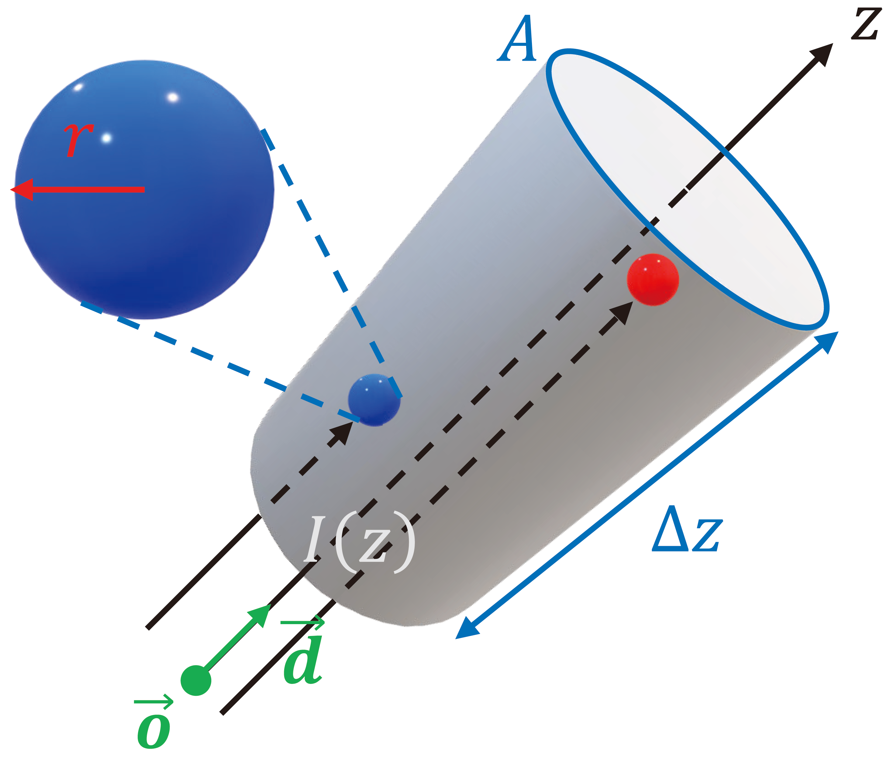

A ray with origin $\boldsymbol{o}$ and direction $\boldsymbol{d}$ casts to an arbitrary region of bounded space. Assume, for simplicity, that the cross section area $A$ is uniform along the ray. Let's focus on a slice of the region with thickness $\Delta z$.

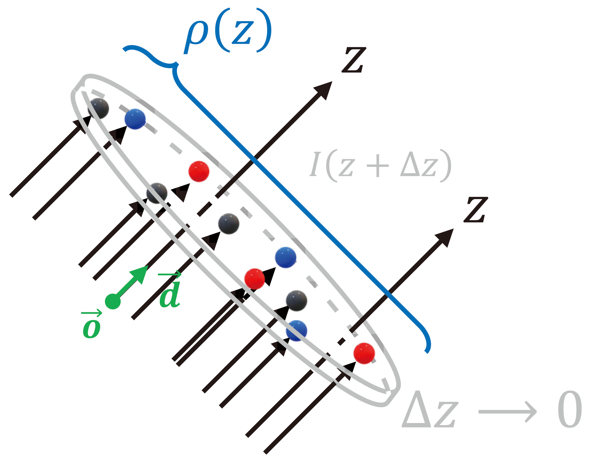

Occluding objects are modeled as spherical particles with radius $r$. Let $\rho(z\gray{; \boldsymbol{o}, \boldsymbol{d}})$ denote the particle density — number of particles per unit volume — in that orientation. If $\Delta z$ is small enough such that $\rho(z)$ is consistent on the slice, then there are
$$
\underbrace{A \cdot \Delta z}_\text{slice volume} \cdot \rho(z)
$$
particles contained in the slice. When $\Delta z \rightarrow 0$, solid particles do not overlap, then a total of
$$
\underbrace{A \cdot \Delta z}_\text{slice volume} \cdot \rho(z) \cdot \underbrace{\pi r^2}_\text{particle area}
$$
area is occluded, which amounts to a portion of $\frac{A \Delta z \cdot \rho(z) \cdot \pi r^2}{A} = \pi r^2 \rho(z) \Delta z$ of the cross section. Let $I(z\gray{; \boldsymbol{o}, \boldsymbol{d}})$ denote the *light intensity* at depth $z$ from origin $\boldsymbol{o}$ along direction $\boldsymbol{d}$. If a portion of $\pi r^2 \rho(z) \Delta z$ of all rays are occluded, then the intensity at depth $z + \Delta z$ decreases to
$$
I(z + \Delta z) = (1 - \underbrace{\pi r^2 \rho(z) \Delta z}_\text{occluded portion})I(z)
$$
The difference in intensity is
$$
\begin{align*}
\Delta I
&=
I(z + \Delta z) - I(z) \\
&=
-\pi r^2 \rho(z) \Delta z \ I(z)
\end{align*}
$$
Take <span id="d2c">a step from discrete to continuous</span>, we have
$$
dI(z) = - \underbrace{\pi r^2 \rho(z)}_{\sigma(z)} I(z) \ dz
$$

Define volume density (or voxel "opacity") $\sigma(z\gray{; \boldsymbol{o}, \boldsymbol{d}}) := \pi r^2 \rho(z\gray{; \boldsymbol{o}, \boldsymbol{d}})$. This makes sense because the amount of ray reduction depends on both the number of occluding particles and the size of them, then the solution to the ODE
$$
dI(z) = -\sigma(z) I(z) \ dz
$$
is
$$
I(z) = I(z_0) \ \underbrace{e^{\int_{z_0}^{z} -\sigma(s) \ ds}}_{T(z)}
$$

::: details Step-by-step solution
Exchange the terms at both sides of the ODE:
$$
\frac{1}{I(z)} \ dI(z) = -\sigma(z) \ dz
$$
which is a *separable* DE. Integrate both sides
$$
\begin{align*}
\int \frac{1}{I(z)} \ dI(z) &= \int -\sigma(z) \ dz \\
\ln I(z) &= \int -\sigma(z) \ dz + C \\
I(z) &= C e^{\int -\sigma(z) \ dz}
\end{align*}
$$
Suppose $I$ takes $I(z_0)$ at depth $z_0$, then
$$
I(z) = I(z_0) \ e^{\int_{z_0}^{z} -\sigma(s) \ ds}
$$
:::

Define <span id="transmittance">accumulated *transmittance*</span> $T(z) := e^{\int_{z_0}^{z} -\sigma(s) \ ds}$, then $I(z) = I(z_0)T(z)$ means the **remainning** intensity after the rays travels from $z_0$ to $z$. $T(z)$ can also be viewed as the *cumulative density function* (CDF) that a ray does **not** hit any particles from $z_0$ to $z$. But **no** color will be observed if a ray passes empty space; radiance is "emitted" only when there is **contact** between rays and particles. Define
<span id="hit-cdf"></span>
$$
H(z) := 1 - T(z)
$$
as the CDF that a ray hits particles from $z_0$ to $z$, then its *probability density function* (PDF) is
<span id="hit-pdf"></span>
$$
p_\text{hit}(z) = -\underbrace{e^{\int_{z_0}^{z} -\sigma(s) \ ds}}_{T(z)} \ \sigma(z)
$$

::: details CDF to PDF
Differentiate CDF $H(z)$ (w.r.t. $z$) to get $p_\text{hit}(z)$
$$
\begin{align*}
p_\text{hit}(z)
&=
\frac{dH}{dz} \\
&=
-\frac{dT}{dz} \\
&=
-\frac{d}{dz} e^{\int_{z_0}^{z} -\sigma(s) \ ds} \\
&=
-e^{\int_{z_0}^{z} -\sigma(s) \ ds} \ \frac{d}{dz} \int_{z_0}^{z} -\sigma(s) \ ds \\
&=
-e^{\int_{z_0}^{z} -\sigma(s) \ ds} \ \sigma(z)
\end{align*}
$$
:::

Let a *random variable* a random variable $\mathbf{R}$ denote the emitted radiance, then
$$
\begin{align*}
p_{\mathbf{R}}\gray{(\boldsymbol{r})}
=& \
p_{\mathbf{R}}\gray{(z; \boldsymbol{o}, \boldsymbol{d})} \\
:=& \
P[\mathbf{R} = \boldsymbol{c}\gray{(z)}] \\
=& \
p_\text{hit}\gray{(z)}
\end{align*}
$$
Hence, the color of a pixel is the *expectation* of emitted radiance:
$$
\begin{align*}
\mathbf{C}(\boldsymbol{r})
\gray{=
\mathbf{C}(z; \boldsymbol{o}, \boldsymbol{d})}
&=
\mathbb{E} (\mathbf{R}) \\
&=
\int_0^\infty \mathbf{R} \ p_{\mathbf{R}} \ dz \\
&=
\int_0^\infty \boldsymbol{c} \ p_\text{hit} \ dz \\
&=
\int_0^\infty T(z) \sigma(z) \boldsymbol{c}(z) \ dz
\end{align*}
$$
concluding the proof.

<!-- This is actually a `note` container. -->
::: info Integration bounds
In practice, $\boldsymbol{c}$, obtained from MLP query, is a function of both position $z$ (or coordinate $\boldsymbol{x}$) and view direction $\boldsymbol{d}$. Also different are the integration bounds. A computer does not support an infinite range; the lower and upper bounds of integration are $z_\text{n\gray{ear}} = \verb|near|$ and $z_\text{f\gray{ar}} = \verb|far|$ within the range of floating point representation:
$$
\mathbf{C}(\boldsymbol{r})
=
\int_\verb|near|^\verb|far| T(z) \sigma(z) \boldsymbol{c}(z) \ dz
$$
In NeRF, $\verb|near| =$ `0.` and $\verb|far| =$ `1.` for scaled **bounded** scenes and front facing scenes after [conversion to normalized device coordinates (NDC)](./nerf_ndc.md).
:::

### Numerical quadrature

We took [a step from discrete to continuous](#d2c) to derive the rendering integral. Nevertheless, integration on a continuous domain is not supported by computers. An alternative is numerical quadrature. Sample $\verb|near| \lt z_1 \lt z_2 \lt \cdots \lt z_{N} \lt \verb|far|$ along a ray, and define differences between adjacent samples as<span id="delta"></span>
$$
\delta_i := z_{i+1} - z_i \ \forall i \in \{1,\ldots,N-1\}
$$
then the [transmittance](#transmittance) is approximated by
$$
\begin{align*}
T_i :=&\ T(z_i) \\
\approx&\
e^{-\sum_{j=1}^{i\blue{-1}} \sigma_j \delta_j}
\end{align*}
$$
where [$T_1 = 1$](#t1) and $\sigma_j = \sigma(z_j\gray{; \boldsymbol{o}, \boldsymbol{d}})$. Meanwhile, differentiation in $p_\text{hit}(z)$ is also substituted by **discrete difference**. That is,
$$
\begin{align*}
p_i := p_\text{hit}(z_i)
&=
\left. \frac{dH}{dz} \right|_{z_i} \\
&\approx
H(z_{i+1}) - H(z_i) \\
&\gray{=
1- T(z_{i+1}) - \left(1- T(z_i)\right)} \\
&=
T(z_i) - T(z_{i+1}) \\
&=
T_i \left(1 - e^{-\sigma_i \delta_i}\right)
\end{align*}
$$

::: details Step-by-step solution
$$
\begin{align*}
T(z_i) - T(z_{i+1})
&=
T(z_i) \left(1 - \frac{T(z_{i+1})}{T(z_i)}\right) \\
&=
T(z_i) \left( 1 - \frac{e^{-\sum_{j=1}^{\green{i}} \sigma_j \delta_j}}{e^{-\sum_{j=1}^{\blue{i-1}} \sigma_j \delta_j}} \right) \\
&=
T(z_i) \left(1 - e^{-\sum_{j=1}^{\green{i}} \sigma_j \delta_j + \sum_{j=1}^{\blue{i-1}} \sigma_j \delta_j}\right) \\
&=
T_i \left(1 - e^{-\sigma_{\green{i}} \delta_{\green{i}}}\right)
\end{align*}
$$
:::

Hence, the discretized emmitted radiance is
$$
\begin{align*}
\hat{\mathbf{C}}(\boldsymbol{r})
\gray{=
\hat{\mathbf{C}}(z; \boldsymbol{o}, \boldsymbol{d})}
&=
\mathbb{E} (\mathbf{R}) \\
&=
\int_\verb|near|^\verb|far| \mathbf{R} \ p_{\mathbf{R}} \ dz \\
&\approx
\sum_{i=1}^N \boldsymbol{c}_i T_i \left(1 - e^{-\sigma_i \delta_i}\right)
\end{align*}
$$
where $\boldsymbol{c}_i := \boldsymbol{c}(z_i\gray{; \boldsymbol{o}, \boldsymbol{d}})$ is the output RGB upon MLP query at $\{z_i \ | \ \boldsymbol{o}, \boldsymbol{d}\}$.

Note that if we denote <span id="alpha">$\alpha_i := 1 - e^{-\sigma_i \delta_i}$</span>, then $\hat{\mathbf{C}}(\boldsymbol{r}) = \sum_{i=1}^N \alpha_i T_i \boldsymbol{c}_i$ resembles classical <span id="compositing">*alpha compositing*</span>.

<!-- This is actually an `info` container. -->
:::: note Alpha compositing <!-- chater 3.4, FoCG -->

Consider the case where a foreground object is inserted ahead of the background. Now that a pixel displays a single color, we have to blend the colors of the two. *Compositing* is applied when there are **partially** transparent regions within the foreground object, or the foreground object **partially** covers the background.

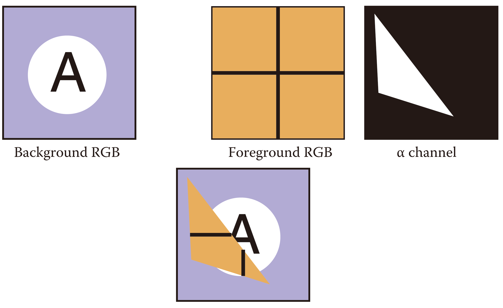

In *alpha compositing*, a parameter $\alpha$ determines the extent to which each object contributes to what is displayed in a pixel. Let $\alpha$ denote the opacity (or *pixel coverage*) of the foreground object, then a pixel showing foreground color $\boldsymbol{c}_f$ over background color $\boldsymbol{c}_b$ is composited as
$$
\boldsymbol{c} = \alpha \boldsymbol{c}_f + (1 - \alpha) \boldsymbol{c}_b
$$

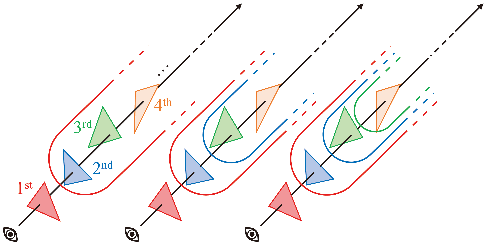

When blending colors of multiple objects, one can adopt a *divide-and-conquer* approach. Each time, cope with the unregistered object closest to the eye and treat the remaining objects as a **single** entity. Such a strategy is formulated by
$$
\begin{align*}
\boldsymbol{c}
&=
\red{\alpha_1 \boldsymbol{c}_1} + (1 - \red{\alpha_1})\left(
    \blue{\alpha_2 \boldsymbol{c}_2} + \left( 1 - \blue{\alpha_2} \right)\left(
        \green{\alpha_3 \boldsymbol{c}_3} + \left( 1 - \green{\alpha_3} \right)\left(
            \orange{\alpha_4 \boldsymbol{c}_4} + (1 - \orange{\alpha_4})\left(
                \cdots
            \right)
        \right)
    \right)
\right) \\
&=
\red{\alpha_1 \boldsymbol{c}_1}
+ (1 - \red{\alpha_1})\blue{\alpha_2 \boldsymbol{c}_2} \\
& \ \ \ \ \ \ \ \ \ \ \ \ \
+ (1 - \red{\alpha_1})( 1 - \blue{\alpha_2})\left(
        \green{\alpha_3 \boldsymbol{c}_3} + \left( 1 - \green{\alpha_3} \right)\left(
            \orange{\alpha_4 \boldsymbol{c}_4} + (1 - \orange{\alpha_4})\left(
                \cdots
            \right)
        \right)
    \right) \\
&=
\red{\alpha_1 \boldsymbol{c}_1}
+ (1 - \red{\alpha_1})\blue{\alpha_2 \boldsymbol{c}_2} \\
& \ \ \ \ \ \ \ \ \ \ \ \ \
+ (1 - \red{\alpha_1})(1 - \blue{\alpha_2})\green{\alpha_3 \boldsymbol{c}_3} \\
& \ \ \ \ \ \ \ \ \ \ \ \ \
+ (1 - \red{\alpha_1})(1 - \blue{\alpha_2})(1 - \green{\alpha_3})\left(
            \orange{\alpha_4 \boldsymbol{c}_4} + (1 - \orange{\alpha_4})\left(
                \cdots
            \right)
        \right) \\
&=
\red{\alpha_1 \boldsymbol{c}_1}
+ (1 - \red{\alpha_1})\blue{\alpha_2 \boldsymbol{c}_2} \\
& \ \ \ \ \ \ \ \ \ \ \ \ \
+ (1 - \red{\alpha_1})(1 - \blue{\alpha_2}) \green{\alpha_3 \boldsymbol{c}_3} \\
& \ \ \ \ \ \ \ \ \ \ \ \ \
+ (1 - \red{\alpha_1})(1 - \blue{\alpha_2})(1 - \green{\alpha_3})\orange{\alpha_4 \boldsymbol{c}_4} \\
& \ \ \ \ \ \ \ \ \ \ \ \ \
+ (1 - \red{\alpha_1})(1 - \blue{\alpha_2})(1 - \green{\alpha_3})(1 - \orange{\alpha_4})\left(
                \cdots
            \right) \\
&\cdots
\end{align*}
$$
which is essentially a *tail recursion*.

::: details Alpha compositing in NeRF
There are $N$ samples along each ray in NeRF. Consider the first $N - 1$ samples as occluding foreground objects with opacity $\alpha_i$ and color $\boldsymbol{c}_i$, and the last sample as background, then the blended pixel value is
$$
\begin{align*}
\tilde{\mathbf{C}}
&=
\alpha_1 \boldsymbol{c}_1
+ (1 - \alpha_1) \alpha_2 \boldsymbol{c}_2 \\
& \ \ \ \ \ \ \ \ \ \ \ \ \
+ (1 - \alpha_1)(1 - \alpha_2) \alpha_3 \boldsymbol{c}_3 \\
& \ \ \ \ \ \ \ \ \ \ \ \ \
+ (1 - \alpha_1)(1 - \alpha_2)(1 - \alpha_3) \alpha_4 \boldsymbol{c}_4 \\
& \ \ \ \ \ \ \ \ \ \ \ \ \
\cdots \\
& \ \ \ \ \ \ \ \ \ \ \ \ \
+ (1 - \alpha_1)(1 - \alpha_2)(1 - \alpha_3) \cdots (1 - \alpha_{N-1}) \boldsymbol{c}_N \\
&=
\sum_{i=1}^{N} \left(\alpha_i \boldsymbol{c}_i \prod_{j=1}^{i-1} \left(1 - \alpha_j\right)\right)
\end{align*}
$$
where $\alpha_0 = 0$. Recall $\hat{\mathbf{C}} = \sum_{i=1}^N \alpha_i T_i \boldsymbol{c}_i$, then it remains to show that $\prod_{j=1}^{i-1} \left(1 - \alpha_j\right) = T_i$:
$$
\begin{align*}
\prod_{j=1}^{i-1} \left(1 - \alpha_j\right)
&=
\prod_{j=1}^{i-1} e^{-\sigma_j \delta_j} \\
&=
\exp \left( \sum_{j=1}^{i-1} -\sigma_j \delta_j \right) \\
&= T_i
\end{align*}
$$
concluding the proof. This manifests the elegancy of differentiable volume rendering.
:::
::::

Rewrite <span id="weight">$w_i := \alpha_i T_i$</span>, then the expectation of emmitted radiance <span id="color">$\mathbf{C}(\boldsymbol{r}) = \sum_{i=1}^N w_i \boldsymbol{c}_i$</span> is weighted sum of colors.

### Why (trivially) differentiable?

Given the above renderer, a coarse training pipeline is
$$
\left.
\begin{array}{r}
\text{ground truth} \ \mathbf{C} \\
(\boldsymbol{x}, \boldsymbol{d}) \xrightarrow{\text{MLP}} (\boldsymbol{c}, \sigma) \xrightarrow{\text{discrete rendering}} \text {prediction} \ \hat{\mathbf{C}}
\end{array}
\right\}

\xrightarrow{\text{MSE}}
\mathcal L = \| \hat{\mathbf{C}} - \mathbf{C} \|_{\gray{2}}^2
$$

If the discrete renderer is differentiable, then we can train the *end-to-end* model through gradient descent. No suprise, given a (sorted) sequence of random samples $\boldsymbol{t} = \{t_1, t_2, \ldots, t_N\}$, the derivatives are
$$
\begin{align*}
\left. \frac{d \hat{\mathbf{C}}}{d \boldsymbol{c}_i} \right|_{\boldsymbol{t}}
&=
T_i \left(1 - e^{-\sigma_i \delta_i} \right) \\

\left. \frac{d \hat{\mathbf{C}}}{d \sigma_i} \right|_{\boldsymbol{t}}
&=
\boldsymbol{c}_i \left( \green{\frac{d T_i}{d \sigma_i}} \blue{\left( 1 - e^{-\sigma_i \delta_i} \right)} + \green{T_i} \blue{\frac{d}{d \sigma_i} \left( 1 - e^{-\sigma_i \delta_i} \right)} \right) \\
&=
\mathbf{c}_i \left( \blue{\left( 1 - e^{-\sigma_i \delta_i} \right)} \green{\exp \left(-\sum_{j=1}^{i-1} \sigma_j \delta_j \right)} \underbrace{\green{\frac{d}{d \sigma_i} \left( -\sum_{j=1}^{i-1} \sigma_j \delta_j \right)}}_{0} + \green{T_i} \blue{\left( -e^{-\sigma_i \delta_i} \right) \frac{d(-\sigma_i \delta_i)}{d \sigma_i}} \right) \\
&=
\delta_i T_i \boldsymbol{c}_i e^{-\sigma_i \delta_i}
\end{align*}
$$

Once the renderer is differentiable, weights and biases in an MLP can be updated via the chain rule.

<!-- This is actually a `note` container. -->
::: info Coarse-to-fine approach
NeRF jointly optimizes coarse and fine network.
:::

<!--
### Why two networks?

coarse to fine
-->

## Analysis

Whereas NeRF is [originally implemented](https://github.com/bmild/nerf) in [Tensrorflow](https://www.tensorflow.org/), code analysis is based on a [faithful reproduction](https://github.com/yenchenlin/nerf-pytorch) in [PyTorch](https://pytorch.org/). The repository is organized as

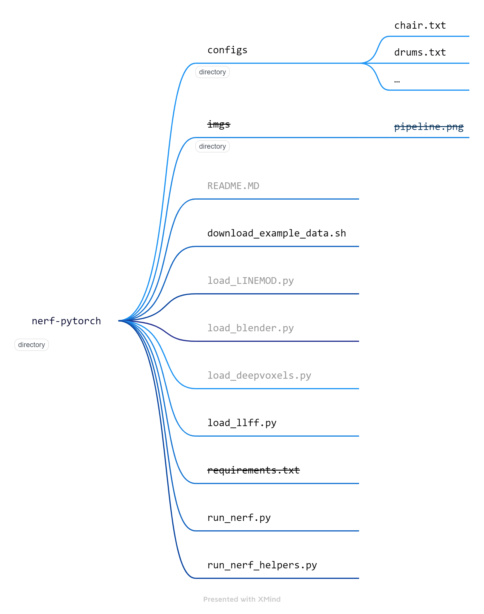

Let's experiment with the [LLFF dataset](https://drive.google.com/drive/folders/14boI-o5hGO9srnWaaogTU5_ji7wkX2S7), which is comprised of front-facing scenes with camera poses. Pertinent directories and files are

| Item      | Type      | Description|
| ---       | ---       | ---        |
| `configs` | directory | contains per scene configuration (`.txt`) for the LLFF dataset |
| `download_example_data.sh` | shell script  | to download datasets |
| `load_llff.py` | Python script | data loader of the LLFF dataset |
| `run_nerf.py`  | Prthon script | main procedures |
| `run_nerf_helpers.py`      | Python script | utility functions |

<!-- This is actually a `note` container -->
::: info Modified identation and comments
Codes in this post deviate slightly from the [authentic version](https://github.com/yenchenlin/nerf-pytorch). Dataflow and function calls remain intact whereas indentation and comments are modified for the sake of readibility.
:::

### The big picture

@[code{865-867} python{3}](./run_nerf.py)

As shown, `train(…)` in `run_nerf.py` is the execution entry to the project. The entire training process is

@[code{535-862} python:line-numbers](./run_nerf.py)

which is lengthy and potentially obscure. Function calls are visualized below, which assists comprehension of the rendering pipeline.

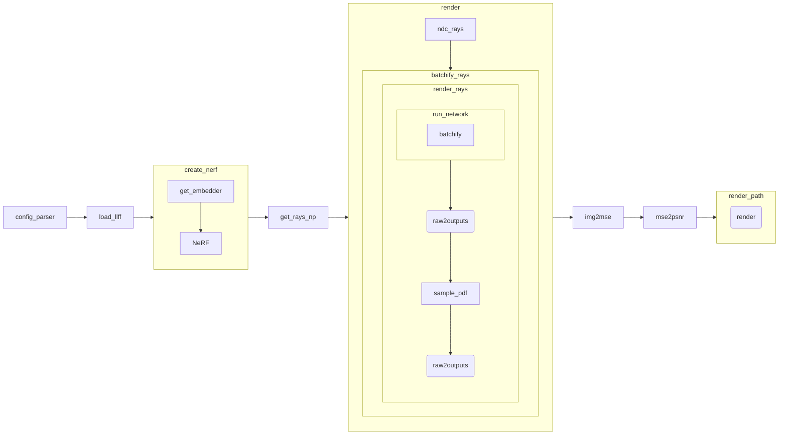

As captioned, let's concentrate on implementating volume rendering in this post. Our journey starts from rays generation (`get_rays_np(…)` at line $\verb|144|$) and culminates in learning rate update (lines $\verb|242|$ to $\verb|246|$) in each iteration.

Prior to rendering is the data loader (lines $\verb|7|$ to $\verb|104|$) and network initialization (lines $\verb|107|$ to $\verb|116|$). We ommit the analysis of the data loader. Though loaded images and poses will be introduced upon their first appearance, feel free to peruse [this post](https://blog.csdn.net/NGUever15/article/details/123862996) for details. Neither will we delve into lines $\verb|119|$ to $\verb|136|$, which terminates the project immediately after rendering a novel view or video. Testing NeRF is not our primary concern. Despite this, network creation and initialization will be covered in [appendix](#appendix).

::: tip Functions analyses are organized in horizontal tabs.
As you see in the function flow chart, procedure call is complex in NeRF. To facilitate clearity, there will be a few horizontal tabs in a section, each responsible for a single function.
:::

### Training set

:::: tabs

@tab Data preparation

@[code{672-689} python:line-numbers](./run_nerf.py)

There are $2$ command line argument variables (CL args) in the above snippet:

| Variable      | Value | Description |
| ---           | ---   | ---         |
| `N_rand`      | $32 \times 32 \times 4 = 4096$ by default| batch size: number of random rays per optimization loop |
| `no_batching` | `False` by default | whether or not adopt rays from a **single** image per iteration |

`use_batching`, therefore, is asserted by default. The conditioned block contains in lines $\verb|7|$ to $\verb|11|$ a few alien variables, most of which are relevant to the dataloader (lines $\verb|7|$ to $\verb|104|$ in [`train(…)`](#the-big-picture)):

| Variable  | Type  | Dimension | Description |
| ---       | ---   | ---       | ---         |
| `H`       | `int` |           | height of image plane $H$ in pixels |
| `W`       | `int` |           | width of image plane $W$ in pixles |
| `K`       | NumPy array | $(3, 3)$ | $\mathbf{K} = \begin{bmatrix} f_{\text{camera}} & 0 & \frac{W}{2} \\ 0 & f_{\text{camera}} & \frac{H}{2} \\ 0 & 0 & 1 \end{bmatrix}$, where $f_{\text{camera}}$ is the focal length of the camera, is a calibration matrix, also the camera intrinsics. It is defined from line $\texttt{82}$ to $\texttt{87}$ in [`train(…)`](#the-big-picture). |
| `poses`   | NumPy array | $(\texttt{num\_img}, 3, 5)$ | all camera poses, where $\texttt{num\_img}$ is the number of images in a scene |
| `images`  | NumPy array | $(\texttt{num\_img}, H, W, 3)$ | all images |
| `i_train` | NumPy array | $(\texttt{num\_img} \times \frac{7}{8},)$| indices of training images, `i_train` $= [0, \texttt{num\_img}) \ \setminus$ `i_test`<br>`i_test` is initially provided by the dataloader (line $\texttt{9}$ in [`train(…)`](#the-big-picture)); it is then overridden by lines $\texttt{18}$ to $\texttt{20}$ since `args.llffhold` is $8$ by default. |

::: details Camera intrinsics <!-- chapter 2.1 CV:AA -->
The calibration matrix takes a general form
$$
\mathbf{K}
=
\begin{bmatrix}
f_{\text{camera}} & s & c_x \\
0 & a f_{\text{camera}} & c_y \\
0 & 0 & 1
\end{bmatrix}
$$
for some *aspect ratio* $a$, skew $s$, and [*principle point*](https://en.wikipedia.org/wiki/Pinhole_camera_model#Geometry) $\begin{bmatrix}c_x & c_y\end{bmatrix}^\mathsf{T}$.

$a = 1$ unless pixels are not square. "$s$ encodes possible skew between the sensor axes due to the sensor not being mounted perpendicular to the optical axis." $\begin{bmatrix}c_x & c_y\end{bmatrix}^\mathsf{T}$ denotes the image center in pixel coordinates. In practice, $\mathbf{K}$ is simplified to
$$
\mathbf{K}
=
\begin{bmatrix}
f_{\text{camera}} & 0 & \frac{W}{2} \\
0 & f_{\text{camera}} & \frac{H}{2} \\
0 & 0 & 1
\end{bmatrix}
$$
:::

`get_rays_np(…)` is then invoked at line $\verb|7|$ to generate rays (see right tab). Iterating all images, `rays` has shape $(\verb|num_img|, 2, H, W, 3)$. Lines $\verb|9|$ and $\verb|10|$ packs `rays_o`, `rays_d`, and `images` together with their dimension changed to $(\verb|num_img|, H, W, 3, 3)$. Lines $\verb|11|$ to $\verb|15|$ filter and [shuffle](https://numpy.org/doc/stable/reference/random/generated/numpy.random.shuffle.html) rays in the training set, whose final result `rays_rgb` is of dimension $(\verb|num_ray|, 3, 3)$.

::: warning Misleading comment
Training set dimension is commented to be $\left((\verb|num_img|-1) \times H \times W, 3, 3\right)$ at line $\verb|12|$, which implies only $1$ image in a scene is for testing. This is not true for the LLFF dataset. Behavior of the dataloader is overridden by lines $\verb|18|$ to $\verb|20|$ in [`train(…)`](#the-big-picture).
:::

@tab Rays generation

`get_rays_np(…)` is called by the line `rays = np.stack([get_rays_np(H, W, K, p) for p in poses[:,:3,:4]], 0)`, where `H` and `W` are respectively the height and width of the image plane, and `K` is the camera intrinsics. `p` is more physically involved, detailed below.

Suppose world frame (*canonical coordinates*) is characterized by an orthonormal basis $\{\boldsymbol{x}, \boldsymbol{y}, \boldsymbol{z}\}$ and an origin $\boldsymbol{o}$, and that camera space is defined by an orthonormal basis $\{\boldsymbol{u}, \boldsymbol{v}, \boldsymbol{w}\}$ and an origin $\boldsymbol{e}$. Denote camera space parameters w.r.t. canonical coordinates as
$$
\begin{bmatrix}
\boldsymbol{u}_{\gray{xyz}} & \boldsymbol{v}_{\gray{xyz}} & \boldsymbol{w}_{\gray{xyz}} & \boldsymbol{e}_{\gray{xyz}}
\end{bmatrix}
=
\begin{bmatrix}
x_u & x_v & x_w & x_e \\
y_u & y_v & y_w & y_e \\
z_u & z_v & z_w & z_e  
\end{bmatrix}
$$
then `p` $= \begin{bmatrix}\boldsymbol{u} & \boldsymbol{v} & \boldsymbol{w} & \boldsymbol{e}\end{bmatrix} \in \mathbb{R}^{3 \times 4}$ is the frame-to-canonical matrix that maps rays in camera space to world coordinates

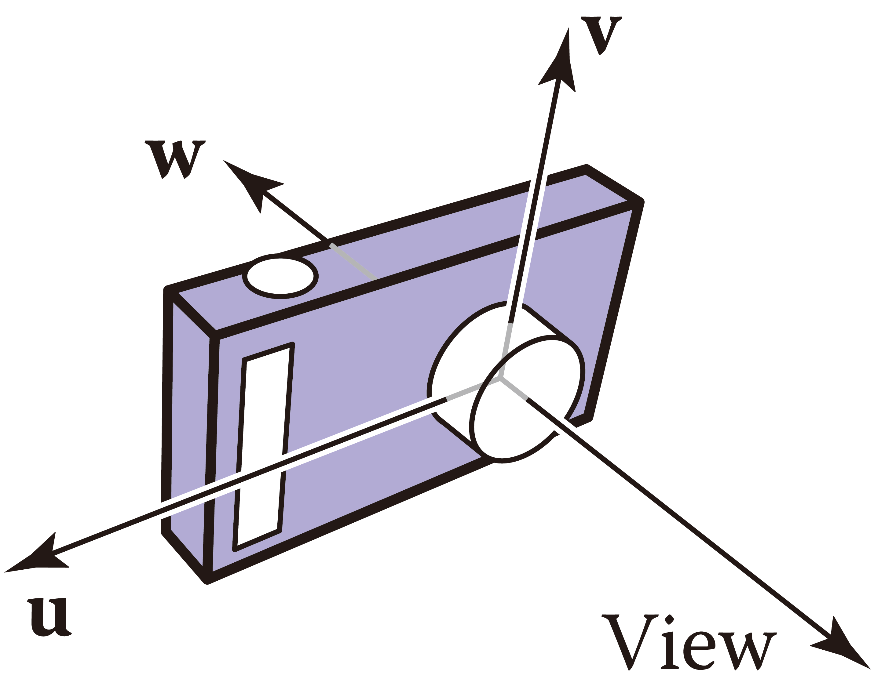

@[code{160-169} python:line-numbers](./run_nerf_helpers.py)

[`np.meshgrid(…)`](https://numpy.org/doc/stable/reference/generated/numpy.meshgrid.html) at line $\verb|2|$ creates a 2D grid of points $[0, H) \times [0, W)$, where arrays `i` and `j` are respectively the $x$- and $y$ coordinates of the grid points. However, the image plane is bounded by
$$
\begin{align*}
\text{\blue{b}ottom: } v &= -\frac{H}{2} \\
\text{\blue{t}op: } v &= -\frac{H}{2} \\
\text{\blue{l}eft: } u &= -\frac{W}{2} \\
\text{\blue{r}ight: } u &= \frac{W}{2}
\end{align*}
$$

<table>
    <tr>
        <td>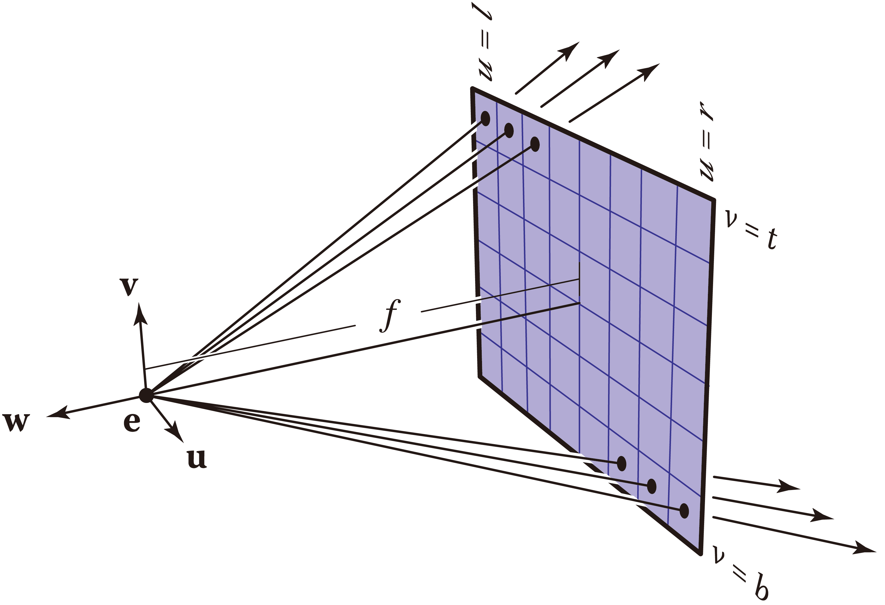</td>
        <td>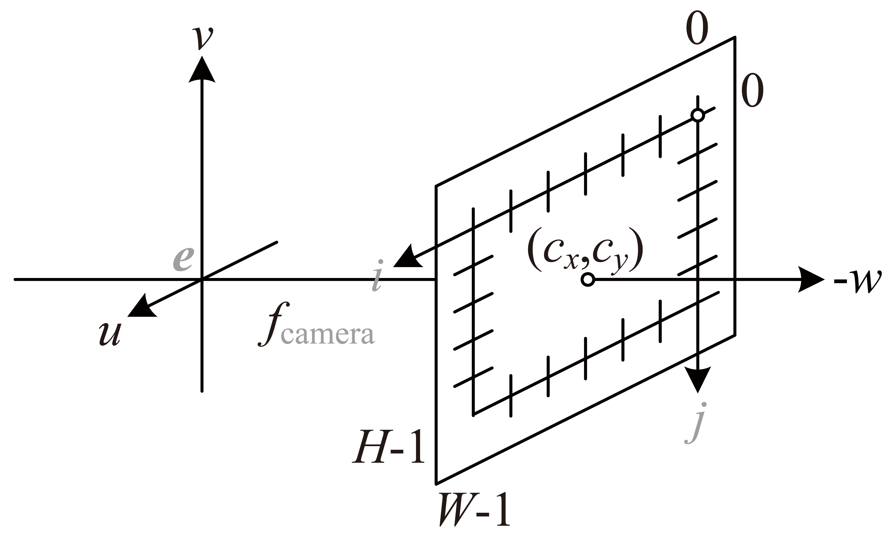</td>
    </tr>
</table>

Applying an offset, pixel coordinates are $\begin{bmatrix} i - \frac{W}{2} & j - \frac{H}{2} & -f_\text{camera} \end{bmatrix}^\mathsf{T}$ in camera frame. A ray is defined by an origin $\boldsymbol{o}_\text{ray}$, which lies at the origin $\boldsymbol{e}$, and its direction $\boldsymbol{d}$ that connects the origin to a pixel. For every pixel $\boldsymbol{p}$ on the image plane, an ejective direction is
$$
\begin{align*}
\boldsymbol{d}
&=
\boldsymbol{p} - \boldsymbol{o}_\text{ray} \\
&=
\begin{bmatrix}
i - \frac{W}{2} \\
j - \frac{H}{2} \\
-f_\text{camera}
\end{bmatrix} \gray{- \boldsymbol{0}}
\end{align*}
$$
which is then "normalized" to $\hat{\boldsymbol{d}} = \frac{\boldsymbol{d}}{f_\text{camera}} = \begin{bmatrix} \frac{i - W/2}{f_\text{camera}} & \frac{j - H/2}{f_\text{camera}} & -1 \end{bmatrix}^\mathsf{T}$. This corresponds to lines $\verb|3|$ to $\verb|5|$, except that `dirs` for an **entire** image are generated concurrently. Note that $j$-axis is opposite to $v$-axis. Consequently, line $\verb|4|$ adopts $-j + \frac{H}{2}$ (instead of $j - \frac{H}{2}$) as $v$-coordinate of $\boldsymbol{d}$.

Rays are then mapped to world space. Apply a linear transformation `c2w` to directions $\boldsymbol{d}$ to obtain `rays_d` (line $\verb|7|$) . Ray origins `rays_o` are simply $\boldsymbol{e}$, the last column of `c2w` (line $\verb|9|$). It is [broadcast](https://numpy.org/doc/stable/reference/generated/numpy.broadcast_to.html) to match the dimension of `rays_d`.

::: details Coordinate transformation <!-- chapter 6.5, FoCG -->
A point $\boldsymbol{p}_{\gray{uvw}} = \begin{bmatrix}u_{\gray{p}} & v_{\gray{p}} & w_{\gray{p}}\end{bmatrix}^\mathsf{T}$ in camera coordinates is characterized by
$$
\boldsymbol{p}_{\gray{uvw}}
=
\gray{\boldsymbol{e}_{xyz} +} u_{\gray{p}}\boldsymbol{u}_{\gray{xyz}} + v_{\gray{p}}\boldsymbol{v}_{\gray{xyz}} + w_{\gray{p}}\boldsymbol{w}_{\gray{xyz}}
$$
alternatively, the same point $\boldsymbol{p}_{\gray{xyz}} = \begin{bmatrix}x_{\gray{p}} & y_{\gray{p}} & z_{\gray{p}}\end{bmatrix}^\mathsf{T}$ in world space is
$$
\boldsymbol{p}_{\gray{xyz}} = \gray{\boldsymbol{o} +} x_{\gray{p}}\boldsymbol{x} + y_{\gray{p}}\boldsymbol{y} + z_{\gray{p}}\boldsymbol{z}
$$
then $\boldsymbol{p}_{\gray{xyz}}$ and $\boldsymbol{p}_{\gray{uvw}}$ are bridged by
$$
\begin{align*}

\begin{bmatrix}
\boldsymbol{p}_{\gray{xyz}} \\ 1
\end{bmatrix}
=
\begin{bmatrix}
x_{\gray{p}} \\ y_{\gray{p}} \\ z_{\gray{p}} \\ 1
\end{bmatrix}
&=
\underbrace{\begin{bmatrix}
\mathbf{I}_{3 \times 3} &
\begin{matrix}
x_e \\ y_e \\ z_e
\end{matrix} \\
\boldsymbol{0}_{1 \times 3} & 1
\end{bmatrix}}_\text{translation: origins coincide}

\underbrace{\begin{bmatrix}
\begin{matrix}
x_u & x_v & x_w \\
y_u & y_v & y_w \\
z_u & z_v & z_w
\end{matrix}
& \boldsymbol{0}_{3 \times 1} \\
\boldsymbol{0}_{1 \times 3} & 1
\end{bmatrix}}_\text{rotation: axes align}

\begin{bmatrix}
u_{\gray{p}} \\ v_{\gray{p}} \\ w_{\gray{p}} \\ 1
\end{bmatrix} \\
&=
\begin{bmatrix}
\begin{matrix}
x_u & x_v & x_w \\
y_u & y_v & y_w \\
z_u & z_v & z_w
\end{matrix} &
\begin{matrix}
x_e \\ y_e \\ z_e
\end{matrix} \\
\boldsymbol{0}_{1 \times 3} & 1
\end{bmatrix}

\begin{bmatrix}
\boldsymbol{p}_{\gray{uvw}} \\ 1
\end{bmatrix} \\
&=
\underbrace{\begin{bmatrix}
\begin{matrix}
\boldsymbol{u} & \boldsymbol{v} & \boldsymbol{w}
\end{matrix} & \boldsymbol{e} \\
\boldsymbol{0}_{1 \times 3} & 1
\end{bmatrix}}_\text{frame-to-canonical matrix}

\begin{bmatrix}
\boldsymbol{p}_{\gray{uvw}} \\ 1
\end{bmatrix}

\end{align*}
$$

Check [3B1B](https://www.3blue1brown.com)'s videos ([linear transformation](https://www.youtube.com/watch?v=kYB8IZa5AuE), [matrix multiplication](https://www.youtube.com/watch?v=XkY2DOUCWMU), and [3D trnsformation](https://www.youtube.com/watch?v=rHLEWRxRGiM)) on linear algebra to comprehend what the above linear transformations (matrices) physically mean.
:::

The returned values are

| Variable | Type | Dimension | Description |
| ---      | ---  | ---       | ---         |
| `rays_o` | NumPy array | $(H, W, 3)$ | directions of rays in the image plane |
| `rays_d` | NumPy array | $(H, W, 3)$ | origins of rays in the image plane |

::::

### Training preparation

```python:line-numbers
def train_prepare(self, data):
    …
    # move training data to GPU
    if use_batching:
        images = torch.Tensor(images).to(device)
    poses = torch.Tensor(poses).to(device)
    if use_batching:
        rays_rgb = torch.Tensor(rays_rgb).to(device)


    N_iters = 200000 + 1
    print('Begin')
    print('TRAIN views are', i_train)
    print('TEST views are', i_test)
    print('VAL views are', i_val)

    # summary writers
    #writer = SummaryWriter(os.path.join(basedir, 'summaries', expname))
    
    start = start + 1
    for i in trange(start, N_iters):
        time0 = time.time()

        # sample random ray batch
        if use_batching:
            # random over all images
            batch = rays_rgb[i_batch:i_batch+N_rand] # [B, 2+1, 3*?]
            batch = torch.transpose(batch, 0, 1)
            batch_rays, target_s = batch[:2], batch[2]

            i_batch += N_rand
            if i_batch >= rays_rgb.shape[0]:
                print("Shuffle data after an epoch!")
                rand_idx = torch.randperm(rays_rgb.shape[0])
                rays_rgb = rays_rgb[rand_idx]
                i_batch = 0
        else:
            …
```

Lines $\verb|2|$ to $\verb|6|$ convert the training set (from NumPy arrays) to PyTorch tensors and "transfer" them to GPU RAM, and `start = start + 1` (line $\verb|18|$) marks the commencement of training iterations. Training data were first divided into batches. Let $B$ denote the batch size ($B =$ `N_rand`), then inputs `batch_rays` and ground truth `target_s` have shape $(2, B, 3)$ and $(B, 3)$ (line $\verb|27|$). Lines $\verb|30|$ to $\verb|34|$ handles out-of-bound cases where the index `i_batch` exceeds $\verb|num_ray|$. We do not care about the `else` block starting from line $\verb|35|$ since `use_batching` is asserted by default.

### Rendering

```python:line-numbers
    …
    for i in trange(start, N_iters):
        …
        #####  core optimization loop  #####
        rgb, disp, acc, extras = render(H, W, K, chunk=args.chunk, rays=batch_rays,
                                                 verbose=i < 10, retraw=True,
                                                 **render_kwargs_train)
        …
```

Ensuing is volume rendering. CL arg `chunk` defines the number of rays concurrently processed, which impacts performance rather than correctness. `render_kwargs_train` is a dictionary returned upon initiating a NeRF network (line $\verb|107|$ in [`train`](#the-big-picture)) with $2$ more keys injected at line $\verb|112|$ (in [`train`](#the-big-picture)). Its internals are <span id="kwargs"></span>

| Key | Element | Description |
| --- | ---     | ---         |
| `network_query_fn` | a function | a subroutine that takes data and a network as input to perform query |
| `perturb`          | `1.`   | whether to adopt stratified sampling, `1.` for `True` |
| `N_importance`     | $128$  | number of addition samples $N_F$ per ray in hierarchical sampling |
| `network_fine`     | an object | the fine network |
| `N_samples`        | $64$   | number of samples $N_C$ per ray to coarse network |
| `network_fn`       | an object | the coarse network |
| `use_viewdirs`     | `True` | whether to feed viewing directions to network, indispensible for view-dependent apprearance |
| `white_bkgd`       | `False`| whether to assume white background for rendering<br><br>This applies to the [synthetic dataset](https://drive.google.com/drive/folders/1JDdLGDruGNXWnM1eqY1FNL9PlStjaKWi) only, which contains images (`.png`) with transparent background. |
| `raw_noise_std`    | `1.`   | magnitude of noise to inject into volume density |
| `near` | `0.` | lower bound of rendering integration |
| `far`  | `1.` | upper bound of rendering integration |

::: note
See [appendix](#appendix) for how a NeRF model is implemented.
:::

:::: tabs

@tab:active Basic procedure

<span id="ndc"></span>

```python:line-numbers
def render(H, W, K, chunk=1024*32, rays=None, c2w=None, ndc=True,
           near=0., far=1.,
           use_viewdirs=False, c2w_staticcam=None,
           **kwargs):
    if c2w is not None:
        # special case to render full image
        rays_o, rays_d = get_rays(H, W, K, c2w)
    else:
        # use provided ray batch
        rays_o, rays_d = rays
    # provide ray directions as input
    if use_viewdirs:
        viewdirs = rays_d
        if c2w_staticcam is not None:
            # special case to visualize effect of viewdirs
            rays_o, rays_d = get_rays(H, W, K, c2w_staticcam)
        viewdirs = viewdirs / torch.norm(viewdirs, dim=-1, keepdim=True)
        viewdirs = torch.reshape(viewdirs, [-1,3]).float()

    sh = rays_d.shape # shape: … × 3
    # for forward facing scenes
    if ndc:
        rays_o, rays_d = ndc_rays(H, W, K[0][0], 1., rays_o, rays_d)
    # create ray batch
    rays_o = torch.reshape(rays_o, [-1,3]).float()
    rays_d = torch.reshape(rays_d, [-1,3]).float()
    near, far = near * torch.ones_like(rays_d[...,:1]), \
                far  * torch.ones_like(rays_d[...,:1])
    rays = torch.cat([rays_o, rays_d, near, far], -1)
    if use_viewdirs:
        rays = torch.cat([rays, viewdirs], -1)
    # render and reshape
    all_ret = batchify_rays(rays, chunk, **kwargs)
    for k in all_ret:
        k_sh = list(sh[:-1]) + list(all_ret[k].shape[1:])
        all_ret[k] = torch.reshape(all_ret[k], k_sh)

    k_extract = ['rgb_map', 'disp_map', 'acc_map']
    ret_list = [all_ret[k] for k in k_extract]
    ret_dict = {k : all_ret[k] for k in all_ret
                                   if k not in k_extract}
    return ret_list + [ret_dict]
```

Lines $\verb|5|$ to $\verb|7|$ and $\verb|14|$ to $\verb|16|$ are ignored because the conditions contradict the default setting. Rays are unpacked to origins and directions at line $\verb|10|$. Viewing directions are aliases to ray directions (line $\verb|13|$) except that they are normalized at line $\verb|17|$. Rays are then projected to NDC space at line $\verb|23|$; see [my other post](./nerf_ndc.html) for details. `near` $= \mathbf{O}_{B \times 3}$ and `far` $= \mathbf{J}_{B \times 3}$ are initiated (lines $\verb|27|$ and $\verb|28|$) to match the shape of `rays_d`. All the above are concatenated (lines $\verb|29|$ to $\verb|31|$) such that input to the network `rays` have dimension $(B, \gray{\verb|rays_o|:} 3 + \gray{\verb|rays_d|:} 3 + \gray{\verb|near|:} 1 + \gray{\verb|far|:} 1 + \gray{\verb|viewdirs|:} 3) = (B, 11)$.

`batchify_rays(…)` at line $\verb|33|$ (see right tab) decomposes the input tensor into mini-batches to feed to the NeRF network sequentially. There are $8$ elements in the `all_ret` dictionary at line $\verb|36|$:

| Key | Description of element |
| --- | ---                    |
| `rgb_map`  | output color map of the **fine** network |
| `disp_map` | output disparity map of the **fine** network |
| `acc_map`  | output accumulated transmittance of the **fine** network |
| `raw`      | raw output of the **fine** network |
| `rgb0`     | output color map of the coarse network |
| `disp0`    | output disparity map of the coarse network |
| `acc0`     | output accumulated transmittance of the coarse network |
| `z_std`    | standard variance of disparities of samples along each ray |

The ensuing lines (line $\verb|38|$ onward) group and reorder the output such that what are returned can be properly unpacked by [`train(…)`](#rendering)

@tab Mini-batch operation

@[code{54-66} python:line-numbers](./run_nerf.py)

Mini-batches are sequentially passed to `render_rays(…)` (see below) at line $\verb|6|$, cached from line $\verb|7|$ to $\verb|10|$, and eventually concatenated at line $\verb|11|$. We may consider `batchify_rays(…)` as a broker connecting the high-level interface (`render(…)`) to actual rendering implementation.

::::

<!-- This is actually a `note` container. -->
::: info Keyword arguments are passed from high-level interface to "worker" procedures.
By encapsulation with `batchify_rays(…)` and `render(…)`, training options `render_kwargs_train` [defined previously](#kwargs) are passed to the low-level "worker" `render_rays(…)`, which is to core of volume rendering.
:::

:::: tabs

@tab:active Rendering each ray

```python:line-numbers
def render_rays(ray_batch,
                network_fn,
                network_query_fn,
                N_samples,
                retraw=False,
                lindisp=False,
                perturb=0., # 1.0, overridden by input
                N_importance=0,
                network_fine=None,
                white_bkgd=False,
                raw_noise_std=0.,
                verbose=False,
                pytest=False):
    N_rays = ray_batch.shape[0]
    rays_o, rays_d = ray_batch[:,0:3], \
                     ray_batch[:,3:6] # (ray #, 3)
    viewdirs = ray_batch[:,-3:] if ray_batch.shape[-1] > 8 \
                                else None
    bounds = torch.reshape(ray_batch[...,6:8], [-1,1,2])
    near, far = bounds[...,0], \
                bounds[...,1] # (ray #, 1)
    t_vals = torch.linspace(0., 1., steps=N_samples)
    if not lindisp:
        z_vals = near * (1. - t_vals) + far * t_vals
    else:
        z_vals = 1. / (1./near * (1. - t_vals) +
                       1./far  * (     t_vals) )
    # copy sample distances of 1 ray to the others
    z_vals = z_vals.expand([N_rays, N_samples])

    if perturb > 0.:
        # get intervals between samples
        mids = .5 * (z_vals[...,1:] + z_vals[...,:-1])
        upper = torch.cat([mids, z_vals[...,-1:]], -1)
        lower = torch.cat([z_vals[...,:1], mids], -1)
        # stratified samples in those intervals
        t_rand = torch.rand(z_vals.shape)
        # pytest: overwrite U with fixed NumPy random numbers
        if pytest:
            np.random.seed(0)
            t_rand = np.random.rand(*list(z_vals.shape))
            t_rand = torch.Tensor(t_rand)

        z_vals = lower + (upper - lower) * t_rand

    pts = rays_o[..., None, :] + \
          rays_d[..., None, :] * z_vals[..., :, None] # (ray #, sample #, 3)
    #raw = run_network(pts)
    raw = network_query_fn(pts, viewdirs, network_fn)
    rgb_map, disp_map, acc_map, weights, depth_map = raw2outputs(raw, z_vals, rays_d, raw_noise_std, white_bkgd, pytest=pytest)
    # hierarchical sampling
    if N_importance > 0:
        # log outputs of coarse network
        rgb_map_0, disp_map_0, acc_map_0 = rgb_map, disp_map, acc_map

        z_vals_mid = .5 * (z_vals[..., 1: ] + z_vals[..., :-1])
        z_samples = sample_pdf(z_vals_mid,
                               weights[..., 1:-1],
                               N_importance,
                               det=(perturb==0.), # FALSE by default
                               pytest=pytest)
        z_samples = z_samples.detach()

        z_vals, _ = torch.sort(torch.cat([z_vals, z_samples], -1), -1)
        pts = rays_o[..., None, :] + \
              rays_d[..., None, :] * z_vals[..., :, None] # (ray #, coarse & fine sample #, 3)

        run_fn = network_fn if   network_fine is None \
                            else network_fine
        #raw = run_network(pts, fn=run_fn)
        raw = network_query_fn(pts, viewdirs, run_fn)

        rgb_map, disp_map, acc_map, weights, depth_map = raw2outputs(raw, z_vals, rays_d, raw_noise_std, white_bkgd, pytest=pytest)

    ret = {'rgb_map' :  rgb_map,
           'disp_map': disp_map,
           'acc_map' :  acc_map}
    if retraw:
        ret['raw'] = raw
    if N_importance > 0:
        ret['rgb0' ] =  rgb_map_0
        ret['disp0'] = disp_map_0
        ret['acc0' ] =  acc_map_0
        ret['z_std'] = torch.std(z_samples, dim=-1, unbiased=False)  # (ray #)
    for k in ret:
        if (torch.isnan(ret[k]).any() or torch.isinf(ret[k]).any()) and DEBUG:
            print(f"! [Numerical Error] {k} contains nan or inf.")
    return ret
```

Lines $\verb|14|$ to $\verb|21|$ unpack each mini-batch to separate physical values. Ray origins `rays_o`, ray directions `rays_d`, and viewing directions `viewdirs` have shape $(B, 3)$. Integration boundaries `near` and `far` are both $B \times 1$ vectors.

Lines $\verb|22|$ to $\verb|44|$ initialize the samples for [ray marching](#ray-marching). [`torch.linspace(…)`](https://pytorch.org/docs/stable/generated/torch.linspace.html) at line $\verb|22|$ create a sequence of $N_C$ points evenly scattered along unit length. Recall that rays are [previously](#ndc) projected to [NDC space](./nerf_ndc.html). `False` by default, `lindisp`  dictates the voxels are sampled linearly on disparity (inverse depth). `z_vals` simply replicates `t_vals` (lines $\verb|24|$ and $\verb|29|$) to modulate all points on a batch of rays.

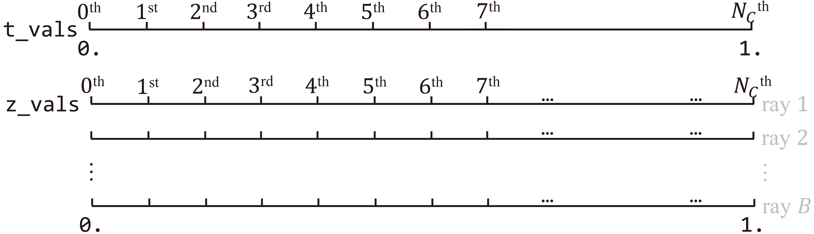

There are $N_C - 1$ intervals along each ray. To pick $N_C$ random points out of those intervals ("bins"), at least $2$ of them should have length less than $\frac{1}{N_C - 1}$. The authors cut the first and last "bin" in half so that all $N_C$ "bins" fit to the interval $[0, 1]$. Line $\verb|33|$ determines of midpoints of `z_vals`, which are afterwards combined with the start (line $\verb|35|$) and endpoint bound (line $\verb|34|$) of each ray.

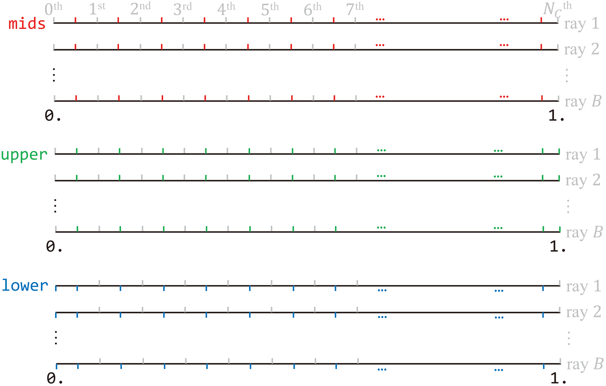

Subtracting the lower bound from the upper bound finalizes the length of "bins", and stratified sampling is achieved by uniformly sampling every interval. Now, sample $z_i$ lies in bin $i \ \forall i \in \{1, 2, \ldots, N_C\}$.

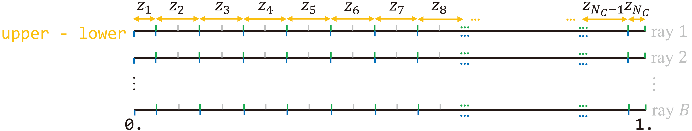

Let $z_i^{(b)}$ denote the $i$^th^ sample on the $b$^th^ ray in a batch, then `z_vals` at line $\verb|44|$ is
$$
\verb|z_vals|
=
\begin{bmatrix}
z_1^{(1)} & z_2^{(1)} & \cdots & z_{N_C}^{(1)} \\
z_1^{(2)} & z_2^{(2)} & \cdots & z_{N_C}^{(2)} \\
\vdots    & \vdots    & \ddots & \vdots        \\
z_1^{(B)} & z_2^{(B)} & \cdots & z_{N_C}^{(B)}
\end{bmatrix}
$$

::: info Sampling: slight deviation of practice from theory
Implementation of stratified sampling is **inconsistent** with what is described in the paper. Theoretically, a sample $z_i$ is obtained via
$$
t_i \sim \mathcal{U}\left[ \verb|near| + \frac{i-1}{N_C} (\verb|far| - \verb|near|), \verb|near| + \frac{i}{N_C} (\verb|far| - \verb|near|) \right]
$$
which implies each "bin" is of equal length. The first and last bins, in practice, are **half** the size of the others. This does not harm the correctness of the algorithm.
:::

Marching depth values `z_vals` along directions `rays_d`, inputs `pts` to `network_fn` at lines $\verb|46|$ and $\verb|47|$ are now
$$
\boldsymbol{r}_{\gray{B \times N_C \times 3}}
=
\begin{bmatrix}
\boldsymbol{e}^{(1)} + z_1^{(1)} \boldsymbol{d}^{(1)} & \boldsymbol{e}^{(1)} + z_2^{(1)} \boldsymbol{d}^{(1)} & \cdots & \boldsymbol{e}^{(1)} + z_{N_C}^{(1)} \boldsymbol{d}^{(1)} \\
\boldsymbol{e}^{(2)} + z_1^{(2)} \boldsymbol{d}^{(2)} & \boldsymbol{e}^{(2)} + z_2^{(2)} \boldsymbol{d}^{(2)} & \cdots & \boldsymbol{e}^{(2)} + z_{N_C}^{(2)} \boldsymbol{d}^{(2)} \\
\vdots & \vdots & \ddots & \vdots \\
\boldsymbol{e}^{(B)} + z_1^{(B)} \boldsymbol{d}^{(B)} & \boldsymbol{e}^{(B)} + z_2^{(B)} \boldsymbol{d}^{(B)} & \cdots & \boldsymbol{e}^{(B)} + z_{N_C}^{(B)} \boldsymbol{d}^{(B)}
\end{bmatrix}
$$

The coarse network `network_fn` is then queried at line $\verb|49|$ to predict raw output `raw` (see [appendix](#appendix) for how NeRF is queried). `raw` has shape $(B, \gray{\verb|rgb|:} 3 + \gray{\sigma:} 1) = (B, 4)$. "[Shading](https://en.wikipedia.org/wiki/Shading)" via `raw2outputs(…)` follows at line $\verb|50|$ to acquire [sample weights](#weight) and radiance of each ray (see middle tab).

To distinguish outputs of the fine network from those of the coarse one, prefixes `_0` are appended to initial outputs at line $\verb|54|$. Provided `z_vals_mid`, midpoints of coarse samples (line $\verb|56|$) and their weights $\mathbf{W}_{\gray{B \times N_C}}$, lines $\verb|57|$ to $\verb|61|$ determine fine samples (see right tab). They are combined with coarse samples at line $\verb|64|$ to form a **sorted** tensor of disparities `z_vals`
$$
\verb|z_vals|
=
\begin{bmatrix}
z_1^{(1)} & z_2^{(1)} & \cdots & z_{N_C \blue{+ N_F}}^{(1)} \\
z_1^{(2)} & z_2^{(2)} & \cdots & z_{N_C \blue{+ N_F}}^{(2)} \\
\vdots    & \vdots    & \ddots & \vdots        \\
z_1^{(B)} & z_2^{(B)} & \cdots & z_{N_C \blue{+ N_F}}^{(B)}
\end{bmatrix}
$$

New inputs `pts` to the fine network `network_fine` at lines $\verb|65|$ and $\verb|66|$ are now
$$
\boldsymbol{r}_{\gray{B \times N_C \times 3}}
=
\begin{bmatrix}
\boldsymbol{e}^{(1)} + z_1^{(1)} \boldsymbol{d}^{(1)} & \boldsymbol{e}^{(1)} + z_2^{(1)} \boldsymbol{d}^{(1)} & \cdots & \boldsymbol{e}^{(1)} + z_{N_C \blue{+ N_F}}^{(1)} \boldsymbol{d}^{(1)} \\
\boldsymbol{e}^{(2)} + z_1^{(2)} \boldsymbol{d}^{(2)} & \boldsymbol{e}^{(2)} + z_2^{(2)} \boldsymbol{d}^{(2)} & \cdots & \boldsymbol{e}^{(2)} + z_{N_C \blue{+ N_F}}^{(2)} \boldsymbol{d}^{(2)} \\
\vdots & \vdots & \ddots & \vdots \\
\boldsymbol{e}^{(B)} + z_1^{(B)} \boldsymbol{d}^{(B)} & \boldsymbol{e}^{(B)} + z_2^{(B)} \boldsymbol{d}^{(B)} & \cdots & \boldsymbol{e}^{(B)} + z_{N_C \blue{+ N_F}}^{(B)} \boldsymbol{d}^{(B)}
\end{bmatrix}
$$

Another mass network query is performed at line $\verb|71|$, whose raw outputs are converted to radiance `rgb_map` at $\verb|71|$.

@tab "Shading"

```python:line-numbers
def raw2outputs(raw, z_vals, rays_d, raw_noise_std=0, white_bkgd=False, pytest=False):
    raw2alpha = lambda raw, dists, act_fn=F.relu : \
                       1. - torch.exp(-act_fn(raw) * dists) # σ column of `raw`

    dists = z_vals[..., 1:] - z_vals[..., :-1]
    dists = torch.cat([dists, # (ray #, sample #)
                       torch.Tensor([1e10]).expand(dists[..., :1].shape)],
                       -1)
    dists = dists * torch.norm(rays_d[..., None, :], dim=-1)

    rgb = torch.sigmoid(raw[..., :3]) # (ray #, sample #, 3)

    noise = 0.
    if raw_noise_std > 0.:
        noise = torch.randn(raw[..., 3].shape) * raw_noise_std
        # overwrite randomly sampled data
        if pytest:
            np.random.seed(0)
            noise = np.random.rand(*list(raw[...,3].shape)) * raw_noise_std
            noise = torch.Tensor(noise)

    alpha = raw2alpha(raw[..., 3] + noise, dists) # (ray #, sample #)
    #weights = alpha * tf.math.cumprod(1.-alpha + 1e-10, -1, exclusive=True)
    weights = alpha * torch.cumprod(torch.cat([torch.ones((alpha.shape[0], 1)),
                                               1. - alpha + 1e-10], -1), 
                                    -1)[:, :-1]

    rgb_map   = torch.sum(weights[..., None] * rgb, -2)  # (ray #, 3)
    depth_map = torch.sum(weights * z_vals, -1)
    disp_map  = 1. / torch.max(1e-10 * torch.ones_like(depth_map),
                               depth_map / torch.sum(weights, -1))
    acc_map   = torch.sum(weights, -1)
    if white_bkgd:
        rgb_map = rgb_map + (1. - acc_map[..., None])

    return rgb_map, disp_map, acc_map, weights, depth_map
```

`dists` from line $\verb|5|$ to $\verb|9|$ calculates the difference between disparities [$\delta_i := z_{i+1} - z_i$](#delta).
$$
\begin{align*}
\mathbf{\Delta}_{\gray{B \times N_C}}
&=
\begin{bmatrix}
\delta_1^{(1)} & \delta_2^{(1)} & \cdots & \delta_{N_C \blue{- 1}}^{(1)} & \gray{\infty} \\
\delta_1^{(2)} & \delta_2^{(2)} & \cdots & \delta_{N_C \blue{- 1}}^{(2)} & \gray{\infty} \\
\vdots & \vdots & \ddots & \vdots & \gray{\vdots} \\
\delta_1^{(B)} & \delta_2^{(B)} & \cdots & \delta_{N_C \blue{- 1}}^{(B)} & \gray{\infty} \\
\end{bmatrix} \\
&=
\begin{bmatrix}
z_2^{(1)} - z_1^{(1)} & z_3^{(1)} - z_2^{(1)} & \cdots & z_{N_C}^{(1)} - z_{N_C - 1}^{(1)} & \gray{\infty} \\
z_2^{(2)} - z_1^{(2)} & z_3^{(2)} - z_2^{(2)} & \cdots & z_{N_C}^{(2)} - z_{N_C - 1}^{(2)} & \gray{\infty} \\
\vdots & \vdots & \ddots & \vdots & \gray{\vdots} \\
z_2^{(B)} - z_1^{(B)} & z_3^{(B)} - z_2^{(B)} & \cdots & z_{N_C}^{(B)} - z_{N_C - 1}^{(B)} & \gray{\infty} \\
\end{bmatrix}
\end{align*}
$$

<!-- This is actually a `note` container. -->
::: info Purpose of appending a large vector
$\verb|1e10| = 10^{10} \approx \infty$ is appended to the last column of $\mathbf{\Delta}_{\gray{B \times N_C}}$ to (a) maintain the shape of `dists` as $(B, N_C)$, and (b) to force the last column of "opacticy" `alpha` $\mathbf{\Delta}_{\gray{B \times N_C}}$ to be 1 such that classic [alpha compositing](#compositing) holds.
:::

Line $\verb|11|$ forces RGB values `rgb` to lie in the range $(0, 1)$, that is,
$$
\mathbf{c}_{\gray{B \times N_C \times 3}}
=
\begin{bmatrix}
\boldsymbol{c}_1^{(1)} & \boldsymbol{c}_2^{(1)} & \cdots & \boldsymbol{c}_{N_C}^{(1)} \\
\boldsymbol{c}_1^{(2)} & \boldsymbol{c}_2^{(2)} & \cdots & \boldsymbol{c}_{N_C}^{(2)} \\
\vdots & \vdots & \ddots & \vdots \\
\boldsymbol{c}_1^{(B)} & \boldsymbol{c}_2^{(B)} & \cdots & \boldsymbol{c}_{N_C}^{(B)} \\
\end{bmatrix}
\forall \boldsymbol{c}_i^{(b)} \in (0, 1)
$$

Random noise (line $\verb|15|$) is injected to volume density $\sigma_i^{(b)}$ (line $\verb|15|$) before it is rectified and raised to [$\alpha_i^{(b)}$](#alpha) (lines $\verb|2|$, $\verb|3|$, and $\verb|22|$). Let $\hat{\sigma}_i^{(b)} := \verb|ReLU| \left( \sigma_i^{(b)} + \mathcal{U}[0, 1] \right)$ denote the recitified "opacity" of the $i$^th^ sample along the $b$^th^ ray, then `alpha` for [alpha compositing](#alpha) are
$$
\begin{align*}
\mathbf{\Alpha}_{\gray{B \times N_C}}
&=
\boldsymbol{1}_{\gray{B \times N_C}} - \exp \left( \boldsymbol{\sigma}_{\gray{B \times N_C}} * \mathbf{\Delta}_{\gray{B \times N_C}} \right) \\
&=
\begin{bmatrix}
1 - e^{- \sigma_1^{(1)} \delta_1^{(1)}} &
1 - e^{- \sigma_2^{(1)} \delta_2^{(1)}} &
\cdots & 1 - e^{- \sigma_{N_C \blue{- 1}}^{(1)} \delta_{N_C \blue{- 1}}^{(1)}}
& 1 \gray{- e^{-\infty}} \\
1 - e^{- \sigma_1^{(2)} \delta_1^{(2)}} &
1 - e^{- \sigma_2^{(2)} \delta_2^{(2)}} &
\cdots & 1 - e^{- \sigma_{N_C \blue{- 1}}^{(2)} \delta_{N_C \blue{- 1}}^{(2)}}
& 1 \gray{- e^{-\infty}} \\
\vdots & \vdots & \ddots & \vdots & \vdots \\
1 - e^{- \sigma_1^{(B)} \delta_1^{(B)}} &
1 - e^{- \sigma_2^{(B)} \delta_2^{(B)}} &
\cdots & 1 - e^{- \sigma_{N_C \blue{- 1}}^{(B)} \delta_{N_C \blue{- 1}}^{(B)}}
& 1 \gray{- e^{-\infty}}
\end{bmatrix} \\
&=
\begin{bmatrix}
\alpha_1^{(1)} & \alpha_2^{(1)} & \cdots & \alpha_{N_C}^{(1)} \\
\alpha_1^{(2)} & \alpha_2^{(2)} & \cdots & \alpha_{N_C}^{(2)} \\
\vdots & \ddots & \vdots & \vdots \\
\alpha_1^{(B)} & \alpha_2^{(B)} & \cdots & \alpha_{N_C}^{(B)}
\end{bmatrix}
\end{align*}
$$
where $*$ denotes the *[Hadamard product](https://en.wikipedia.org/wiki/Hadamard_product_(matrices))*. [`torch.cumprod(…)`](https://pytorch.org/docs/stable/generated/torch.cumprod.html) from line $\verb|24|$ to $\verb|26|$ calculates the [cumulative transmittance](#transmittance)
<span id="t1"></span>
$$
\begin{align*}
\mathbf{T}_{\gray{B \times (N_C \blue{+ 1})}}
&=
\verb|cumprod|
\left(
\begin{bmatrix}
\boldsymbol{1}_{\gray{B \times 1}} \left|\ \boldsymbol{1}_{\gray{B \times N_C}} - \mathbf{\Alpha} \right.
\end{bmatrix}
\right) \\
&=
\verb|cumprod|
\left(
\begin{bmatrix}
1 & e^{- \sigma_1^{(1)} \delta_1^{(1)}}
  & e^{- \sigma_2^{(1)} \delta_2^{(1)}}
  & \cdots
  & e^{- \sigma_{N_C \blue{- 1}}^{(1)} \delta_{N_C \blue{- 1}}^{(1)}} & 0 \\
1 & e^{- \sigma_1^{(2)} \delta_1^{(2)}}
  & e^{- \sigma_2^{(2)} \delta_2^{(2)}}
  & \cdots
  & e^{- \sigma_{N_C \blue{- 1}}^{(2)} \delta_{N_C \blue{- 1}}^{(2)}} & 0 \\
\vdots & \vdots & \vdots & \ddots & \vdots & \vdots \\
1 & e^{- \sigma_1^{(B)} \delta_1^{(B)}}
  & e^{- \sigma_2^{(B)} \delta_2^{(B)}}
  & \cdots
  & e^{- \sigma_{N_C \blue{- 1}}^{(B)} \delta_{N_C \blue{- 1}}^{(B)}} & 0
\end{bmatrix}
\right) \\
&=
\begin{bmatrix}
1 & e^{- \sigma_1^{(1)} \delta_1^{(1)}}
  & e^{- \sigma_1^{(1)} \delta_1^{(1)} - \sigma_2^{(1)} \delta_2^{(1)}}
  & \cdots
  & \exp \left(-\sum_{j=1}^{N_C\blue{-1}} \sigma_j^{(1)} \delta_j^{(1)} \right) & 0 \\
1 & e^{- \sigma_1^{(2)} \delta_1^{(2)}}
  & e^{- \sigma_1^{(2)} \delta_1^{(2)} - \sigma_2^{(2)} \delta_2^{(2)}}
  & \cdots
  & \exp \left(-\sum_{j=1}^{N_C\blue{-1}} \sigma_j^{(2)} \delta_j^{(2)} \right) & 0 \\
\vdots & \vdots & \vdots & \ddots & \vdots & \vdots \\
1 & e^{- \sigma_1^{(B)} \delta_1^{(B)}}
  & e^{- \sigma_1^{(B)} \delta_1^{(B)} - \sigma_2^{(B)} \delta_2^{(B)}}
  & \cdots
  & \exp \left(-\sum_{j=1}^{N_C\blue{-1}} \sigma_j^{(B)} \delta_j^{(B)} \right) & 0
\end{bmatrix} \\
&=
\begin{bmatrix}
T_1^{(1)} & T_2^{(1)} & \cdots & T_{N_C}^{(1)} & \gray{0} \\
T_1^{(2)} & T_2^{(2)} & \cdots & T_{N_C}^{(2)} & \gray{0} \\
\vdots & \vdots & \ddots & \vdots & \gray{\vdots} \\
T_1^{(B)} & T_2^{(B)} & \cdots & T_{N_C}^{(B)} & \gray{0} \\
\end{bmatrix}
\end{align*}
$$
The last column of $\mathbf{T}$ is discarded to match the shape of $\mathbf{\Alpha}$. Rewriting [weights](#weight) (for points' colors) as $w_i^{(b)} := \alpha_i^{(b)}T_i^{(b)}$, `weights` is
$$
\begin{align*}
\mathbf{W}_{\gray{B \times N_C}}
&=
\mathbf{\Alpha} * \mathbf{T} \\
&=
\begin{bmatrix}
\alpha_1^{(1)} \gray{T_1^{(1)}} & \alpha_2^{(1)} T_2^{(1)} & \cdots & \gray{\alpha_{N_C}^{(1)}} T_{N_C}^{(1)} \\
\alpha_1^{(2)} \gray{T_1^{(2)}} & \alpha_2^{(2)} T_2^{(2)} & \cdots & \gray{\alpha_{N_C}^{(2)}} T_{N_C}^{(2)} \\
\vdots & \vdots & \ddots & \vdots \\
\alpha_1^{(B)} \gray{T_1^{(B)}} & \alpha_2^{(B)} T_2^{(B)} & \cdots & \gray{\alpha_{N_C}^{(B)}} T_{N_C}^{(B)} \\
\end{bmatrix} \\
&=
\begin{bmatrix}
w_1^{(1)} & w_2^{(1)} & \cdots & w_{N_C}^{(1)} \\
w_1^{(2)} & w_2^{(2)} & \cdots & w_{N_C}^{(2)} \\
\vdots & \vdots & \ddots & \vdots \\
w_1^{(B)} & w_2^{(B)} & \cdots & w_{N_C}^{(B)} \\
\end{bmatrix}
\end{align*}
$$

Recall that radiance is a [weighted sum of colors](#color) of samples along a ray. This corresponds to line $\verb|28|$, and the output `rgb_map` is
$$
\begin{align*}
\mathbf{C}_{\gray{B \times 3}}
&=
\verb|sum|\left(\mathbf{W} * \mathbf{c}\right) \\
&=
\begin{bmatrix}
w_1^{(1)} \boldsymbol{c}_1^{(1)} +
w_2^{(1)} \boldsymbol{c}_2^{(1)} + \cdots +
w_{N_C}^{(1)} \boldsymbol{c}_{N_C}^{(1)} \\
w_1^{(2)} \boldsymbol{c}_1^{(2)} +
w_2^{(2)} \boldsymbol{c}_2^{(2)} + \cdots +
w_{N_C}^{(2)} \boldsymbol{c}_{N_C}^{(2)} \\
\vdots \\
w_1^{(B)} \boldsymbol{c}_1^{(B)} +
w_2^{(B)} \boldsymbol{c}_2^{(B)} + \cdots +
w_{N_C}^{(B)} \boldsymbol{c}_{N_C}^{(B)} \\
\end{bmatrix} \\
&=
\begin{bmatrix}
\mathbf{C}^{(1)} \\ \mathbf{C}^{(2)} \\ \vdots \\ \mathbf{C}^{(B)}
\end{bmatrix}
\end{align*}
$$

`rgb_map` $\mathbf{C}$ and `weights` $\mathbf{W}$, along with other values, are returned to `render_rays(…)`.

::: details What else are returned?
Content on the way. Stay tuned!
:::

@tab Hierarchical sampling

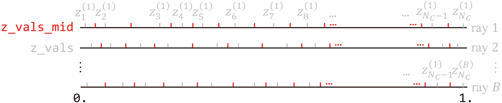

`sample_pdf(…)` in `run_nerf_helpers.py` performs hierarchical sampling via *Monte Carlo method*. It is invoked by
```python
        …
        z_samples = sample_pdf(z_vals_mid,
                               weights[..., 1:-1],
                               N_importance,
                               det=(perturb==0.), # FALSE by default
                               pytest=pytest)
        …
```
in `render_rays(…)`, where `z_vals_mid` is a tensor of midpoints of coarse sample disparities. Note that the leading and trailing columns of `weights` are excluded from the input such that
$$
\mathbf{W}\verb|[..., 1:-1]|
=
\begin{bmatrix}
w_{\blue{2}}^{(1)} & w_3^{(1)} & \cdots & w_{N_C \blue{- 1}}^{(1)} \\
w_{\blue{2}}^{(2)} & w_3^{(2)} & \cdots & w_{N_C \blue{- 1}}^{(2)} \\
\vdots & \vdots & \ddots & \vdots \\
w_{\blue{2}}^{(B)} & w_3^{(B)} & \cdots & w_{N_C \blue{- 1}}^{(B)} \\
\end{bmatrix}
$$

@[code{191-232} python:line-numbers](./run_nerf_helpers.py)

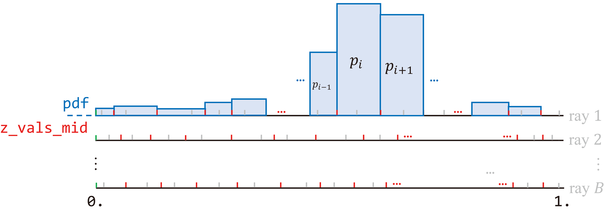

Line $\verb|4|$ defines the probability [$p_i$](#hit-pdf)$:= \frac{w_i}{\sum_{j=\blue{2}}^{\blue{N_C-1}} w_j}$ that a ray is stopped by a particle at depth $\frac{z_i + z_{i+1}}{2}$. This corresponds to the **area** under the histogram, shown above (first ray only).

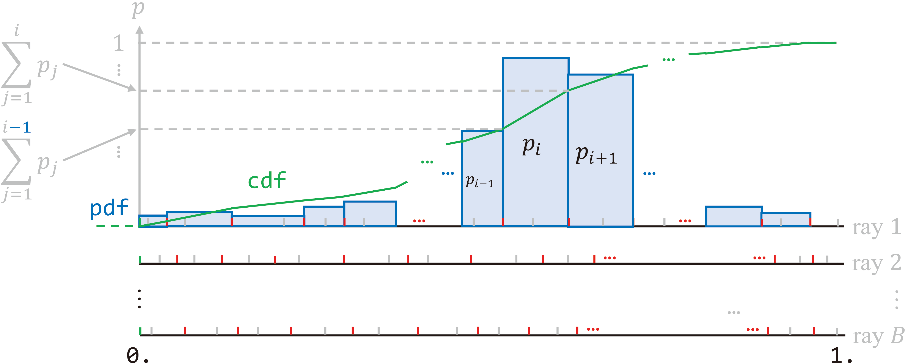

Lines $\verb|5|$ and $\verb|6|$ accumulate the area for the CDF [$H(z)$](#hit-cdf).

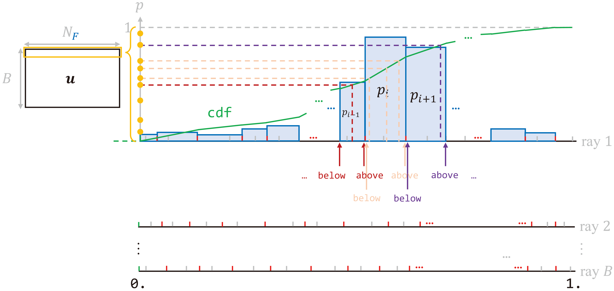

What follows is key to *Monte Carlo sampling*. Line $\verb|12|$ generates a batch $\mathbf{u}_{\gray{B \times N_F}}$ of random cumulative probabilities — "seeds". The above figure visualizes operations on `u[0, :]`, i.e., $N_F$ seeds on the first ray. They fall into the "bins" at line $\verb|25|$ through comparison against the cumulative probabilities at the boundaries. [`torch.searchsorted(…)`](https://pytorch.org/docs/stable/generated/torch.searchsorted.html) returns the positions (indices) `inds` $\in \mathbb{R}^{B \times N_F}$ of those random "seeds".

::: tip Quicker indicing
[`torch.Tensor.contiguous()`](https://pytorch.org/docs/stable/generated/torch.Tensor.contiguous.html) returns a tensor with identical data but contiguous in memory. It is called before `torch.searchsorted(…)` for performance concern.
:::

Lower bounds of the "bins" are collected as `below` at line $\verb|26|$, and upper bounds are gathered as `above` at line $\verb|27|$. `inds_g` $\in \mathbb{R}^{B \times N_F \times 2}$ combines `below` and `above` at line $\verb|28|$. [`torch.gather(…)`](https://pytorch.org/docs/stable/generated/torch.gather.html) at lines $\verb|33|$ and $\verb|34|$ determine how $N_F$ points along each ray are distributed according to indices `inds_g`, or effectively the number of "seeds" in each "bin".

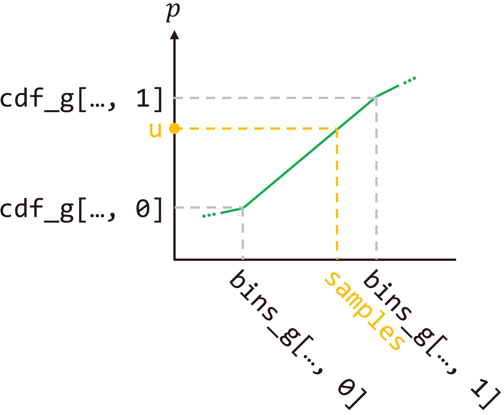

Finally, fine samples are found through *similarity*, whose concept is illustrated above. Indices `0` correspond to `below`, and indices `1` attach to `above`. Given cumulative probabilities `u`, there holds
$$
\frac{\mathbf{u} - \verb|cdf[..., 0]|}{\verb|cdf[..., 1]| - \verb|cdf[..., 0]|}
=
\frac{\gray{\verb|z_|}\verb|samples| - \verb|bins_g[..., 0]|}{\verb|bins_g[..., 1]| - \verb|bins_g[..., 0]|}
$$
Line $\verb|36|$ defines $\verb|denom| := \verb|cdf[..., 1]| - \verb|cdf[..., 0]|$, and line $\verb|39|$ further denotes $\mathbf{t}_{\gray{B \times N_F}} := \frac{\mathbf{u} - \verb|cdf[..., 0]|}{\verb|denom|}$, then
$$
\mathbf{t}_{\gray{B \times N_F}}
=
\frac{\gray{\verb|z_|}\verb|samples| - \verb|bins_g[..., 0]|}{\verb|bins_g[..., 1]| - \verb|bins_g[..., 0]|}
$$
Hence, lines $\verb|40|$ and $\verb|41|$ determine the unsorted output. Fine samples are expressed in offset from (midpoints of) coarse samples `bins_g[..., 0]`.
$$
\gray{\verb|z_|}\verb|samples|
=
\verb|bins_g[..., 0]| + \mathbf{t} * \left( \verb|bins_g[..., 1]| - \verb|bins_g[..., 0]| \right)
$$

::::

### Optimization

```python:line-numbers
    …
    for i in trange(start, N_iters):
        …
        optimizer.zero_grad()
        img_loss = img2mse(rgb, target_s)
        trans = extras['raw'][...,-1]
        loss = img_loss
        psnr = mse2psnr(img_loss)

        if 'rgb0' in extras:
            img_loss0 = img2mse(extras['rgb0'], target_s)
            loss = loss + img_loss0
            psnr0 = mse2psnr(img_loss0)

        loss.backward()
        optimizer.step()

        # NOTE: IMPORTANT!
        ###   update learning rate   ###
        decay_rate = 0.1
        decay_steps = args.lrate_decay * 1000
        new_lrate = args.lrate * (decay_rate ** (global_step / decay_steps))
        for param_group in optimizer.param_groups:
            param_group['lr'] = new_lrate
        ################################
        …
```

Radiance `rgb` $\in \mathbb{R}^{B \times 3}$ is compared against the ground truth `target_s` to obtain the MSE loss at line $\verb|5|$. The total loss also includes that of the coarse network (line $\verb|12|$). The coarse and fine network are jointly optimized at lines $\verb|15|$ and $\verb|16|$. Eventually, learning rate decays from line $\verb|20|$ to $\verb|24|$.

## Summary

This post derives the volmue rendering integral and its numrical quadrature. Also explained is its connection with classical alpha compositing. The second part elaborates on the implementation of the rendering pipeline. Illustrations are included to assist understanding procedures such as rays generation and Monte Carlo sampling. Most importantly, the article clearly specifies the **physical meaning** of each variable and provides the **mathematical operation** for each statement. To sum, the blog functions as a **complete guide** for in-depth comprehension of NeRF.

## References

Chapter 2.1 in [Computer Vision: Algorithms and Applications](https://szeliski.org/Book/)<br>
[Foundations of Computer Graphics](https://www.routledge.com/Fundamentals-of-Computer-Graphics/Marschner-Shirley/p/book/9780367505035)<br>
[NeRF: Representing Scenes as Neural Radiance Fields for View Synthesis](https://arxiv.org/abs/2003.08934)<br>
[NeRF PyTorch implementation](https://github.com/yenchenlin/nerf-pytorch) by [Yen-Chen Lin](https://yenchenlin.me/)<br>
[Neural Radiance Field's Volume Rendering 公式分析](https://raymondkevin.top/2021/07/22/neural-radiance-fields-volume-rendering-%E5%85%AC%E5%BC%8F%E5%88%86%E6%9E%90/)<br>
[Optical Models for Direct Volume Rendering](https://ieeexplore.ieee.org/document/468400)<br>
[Part 1](https://youtu.be/otly9jcZ0Jg?t=5445) of the [SIGGRAPH 2021 course on Advances in Neural Rendering](https://www.neuralrender.com/)<br>
[深度解读yenchenlin/nerf-pytorch项目](https://blog.csdn.net/NGUever15/article/details/123862996)

## Appendix

Content on the way. Stay tuned!

## Errata

| Time | Modification |
| ---  | ---          |
| Aug 31 2022 | Initial release |
<!-- | ? | Add explanation on network creation and intialization | -->
<!-- | ? | Add elaboration on outputs other than `rgb_map` and `weights` | -->